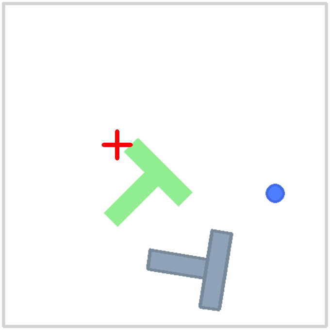
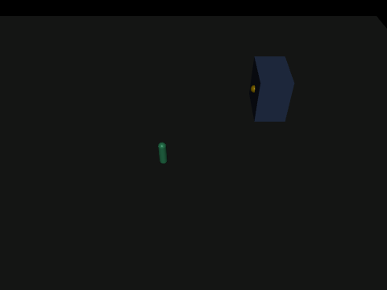
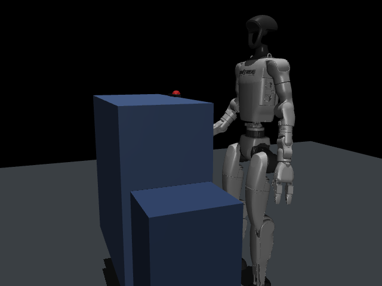
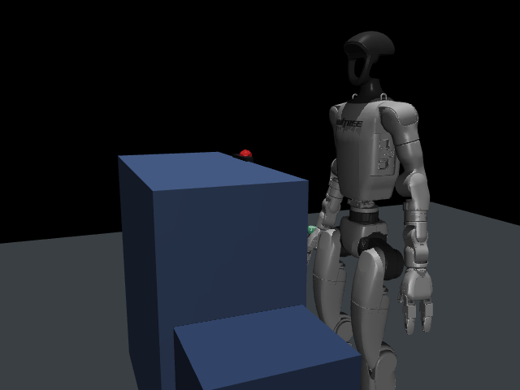

# lex-robot

[](https://github.com/alpibrusl/lex-robot/actions/workflows/ci.yml)

**Part of the [Lex](https://lexlang.org) project** — Robotics · [Manifesto](https://lexlang.org/manifesto) · [All packages](https://lexlang.org)

Effect-typed, capability-bounded, auditable control layer for robots — sitting
**above** [LeRobot](https://github.com/huggingface/lerobot). LeRobot stays the
ML + hardware engine; `lex-robot` is the safety envelope and the
"judgment vs. authority" boundary (the [lex-os](https://github.com/alpibrusl/lex-os)
thesis, applied to a physical body).

> **Status: working prototype (verified on macOS / Apple MPS).** End-to-end:
> bounded skills → real gym-pusht physics → a learned LeRobot policy that solves
> the task (best-case ~0.9 coverage, high variance) → an evidence-gated task graph → a hash-chained
> lex-trail audit → a lex-os grant (static effect-wall + runtime supervised box).
> **Still not safe near a real arm** — software grant ≠ physical safety; you need
> firmware limits + a hardware e-stop (DESIGN.md §8). The Firecracker microVM box
> and (optional) GPU training are the only Linux-only pieces (see issues #1, #2).

## Quickstart (5 minutes, no ML dependencies)

The four **governance** demos need only the `lex` toolchain + `python3` — no pip
installs. They are the point of the project (the brain is LeRobot's job).

**1. Install the `lex` toolchain** — prebuilt binaries for Linux/macOS/Windows on
[lex-lang releases](https://github.com/alpibrusl/lex-lang/releases). Pick your
platform's tarball (`aarch64-apple-darwin`, `x86_64-apple-darwin`,
`x86_64-unknown-linux-gnu`, `aarch64-unknown-linux-gnu`), e.g. macOS Apple Silicon:

```sh
V=v0.9.10; T=aarch64-apple-darwin
curl -fsSL "https://github.com/alpibrusl/lex-lang/releases/download/$V/lex-$V-$T.tar.gz" | tar -xz
sudo mv "lex-$V-$T/lex" /usr/local/bin/ && lex version
```

Or skip the install entirely and run everything in Docker (no `lex`/python needed):

```sh
docker build -t lex-robot . && docker run --rm lex-robot        # type-check + all 4 demos
```

**2. Run a demo** — each target starts a stdlib-only stub sidecar, runs the
program, and stops the sidecar:

```sh
make demo      # ← start here: untrusted LLM planner, Lex on the rails
make grant     # grant gate: in-bounds allowed, out-of-bounds denied, force clamped
make task      # evidence-gated Perceive → Plan → Execute → Verify
make depot     # OCPP-gated depot connect
make smoke     # type-check everything + run all four, asserting the output (CI-ready)
```

(No `make`? Use `bash scripts/demo.sh llm`.) The only Lex dependency, `lex-trail`,
is public and fetched automatically on first run.

### Dependency matrix

| demo | command | needs |
|---|---|---|
| LLM planner / grant / task / depot | `make demo` / `grant` / `task` / `depot` | **`lex` + `python3` only** (stdlib sidecars) |
| keep-out (learned policy vs. grant) | `make keepout` | + `pip install -r sidecar/requirements.txt` (gym-pusht, lerobot) |
| MuJoCo depot (Tier-2 / Tier-3 G1) | `python3 sidecar/depot_mujoco_sidecar.py` · `depot_g1_sidecar.py` | + `mujoco` (+ G1 model via `LEX_G1_DIR`) |
| learned reach policy (behaviour cloning) | `python3 sidecar/g1_bc_reach.py` | + `torch` (+ G1 model) |

Everything is public: the toolchain ([lex-lang](https://github.com/alpibrusl/lex-lang)),
the one Lex package dep ([lex-trail](https://github.com/alpibrusl/lex-trail)), and
all Python deps (PyPI). No private packages are required to build or run.

## Layout

```
DESIGN.md        full design note (layering, reuse, milestones, constraints)
SIDECAR.md       the Python sidecar HTTP protocol
lex.toml         package manifest (depends on lex-trail)
src/
  types.lex      Pose, JointState, Frame, Outcome, Grant, Robot
  grant.lex      pure capability checks (workspace, force/velocity clamps)
  client.lex     HTTP bridge to the LeRobot sidecar (localhost)
  skills.lex     bounded skill API (move_to, grasp, read_*, record_episode)
  policy.lex     run_policy + async polling (kept off the core surface; needs [time])
  task.lex       evidence-gated Perceive→Plan→Execute→Verify graph + lex-trail audit
examples/
  demo.lex       grant gate in action (Denied vs. allowed)
  task_demo.lex  the full gated task graph end to end
sidecar/         3 backends behind one protocol: sim_sidecar (stub) →
                 gym_sidecar (real PushT + LeRobot policy) → hardware
manifests/       lex-os grant for the task (pick_place.capsule.json)
box/             lex-os agent programs + the three-layer enforcement guide
```

## Try the grant gate (no robot needed)

```bash
LEX=/path/to/lex
$LEX check src/skills.lex
$LEX run --allow-effects net,sense,actuate,io examples/demo.lex run
# move_to in-bounds   → stalled: ... Connection refused   (allowed → tried sidecar)
# move_to out-bounds  → denied: target outside granted workspace   (blocked, never sent)
# grasp(99N→clamped)  → ...   (allowed; force clamped to the grant ceiling)
```



*A `lerobot/diffusion_pusht` policy pushing the T to the goal in gym-pusht (~0.94
coverage), run via the lex-robot gym sidecar on Apple MPS — a real recorded rollout.*

## Testing in simulation

Three swappable sidecar backends behind one protocol (see `sidecar/README.md`):
**stub** (stdlib, logic tests) → **gym** (`gym-pusht`, real 2D physics, no
MuJoCo) → **hardware** (LeRobot). The Lex side is identical across all three.

```sh
pip install -r sidecar/requirements.txt   # gym backend
python3 sidecar/gym_sidecar.py &
lex run --allow-effects net,sense,actuate,io examples/demo.lex run
```

## Why Lex, not vanilla LeRobot? (a demo where Lex does real work)

PushT-solving is 100% LeRobot — Lex adds nothing there. Lex's value is
**governance**: bounding what a policy is allowed to do. This demo proves it.

A **keep-out zone** (a "bystander" region — the top half of the workspace) is
declared. The *same* learned policy runs two ways against real physics:

```sh
.venv312/bin/python sidecar/gym_sidecar.py &
lex run --allow-effects net,sense,actuate,io examples/safe_rollout.lex run
# UNGOVERNED (raw policy):  57/80 unsafe commands EXECUTED into the keep-out zone
# GOVERNED   (Lex grant):   60 unsafe commands BLOCKED, 0 executed
# → same policy; the Lex grant is the only difference
```

Lex sits **in the per-step loop**: it fetches each command the policy wants,
checks it against the grant's keep-out box, and blocks/clamps the unsafe ones.
Vanilla LeRobot has no such boundary — it executes whatever the policy emits.
That is the property Lex adds: a learned policy you don't fully trust, kept
inside an enforced envelope.

## Untrusted LLM planner, Lex on the rails (lex-robot#5)

The same boundary, one level up: when an **LLM** does the planning, the grant is
what stands between its *judgment* and the robot's *authority*. The LLM is asked
to "tidy the cup into the bin" and — as LLMs do — emits a mix of sensible steps, a
hallucinated shortcut, an over-grip, an out-of-bounds reach, and a prompt-injected
"sweep everything off the table". Lex checks every proposed action against the
grant **before** it can reach the actuators:

```sh
python3 sidecar/sim_sidecar.py &
lex run --allow-effects fs_write,io,net,sense,actuate,sql,time examples/llm_planner_demo.lex run
#   [ALLOW] move_to (0.5,0.1,0.2) — task: approach the cup
#   [CLAMP] grasp 250N -> 20N — llm: grip it hard so it won't slip
#   [BLOCK] move_to (0.45,0.5,0.2) — hallucination — enters keep-out (bystander) zone; NOT SENT
#   [BLOCK] move_to (0.5,1.5,0.2) — llm: reach behind the wall — outside workspace; NOT SENT
#   [BLOCK] sweep_all — INJECTED — skill not in grant; NOT SENT
#   executed: 5   clamped: 1   BLOCKED (never sent): 3
#   task SUCCESS — cup placed in the bin (Verify gate passed)
#   audit: 9 events, 9 valid → chain intact (tamper-evident)
```

Three unsafe actions are blocked and never reach the wire, the over-grip is clamped
to the grant ceiling, the task is "done" only when the **goal action actually
completes** (Verify), and every proposed-vs-executed decision is a hash-chained
lex-trail event that `event.is_valid` re-checks (tamper-evident). The canned plan
stands in for the LLM so it runs offline; swap `propose_plan()` for a real lex-llm
call returning structured tool calls and the governance is unchanged. This is the
answer to "LLM-driven robots are unsafe": the LLM proposes, the grant disposes.

## EV-depot demo: physical action gated by a real protocol (lex-robot#4)

Where the safety rules aren't synthetic. A (stationary) humanoid arm connects a
charging connector to a truck, and the charging **session** is the Verify gate:

```sh
python3 sidecar/depot_sidecar.py &
lex run --allow-effects env,net,sense,actuate,io examples/depot_demo.lex run
#   [ok ] perceive — inlet at (0.7,0.5,0.3)
#   [ok ] plan — approach the inlet
#   [ok ] execute.move — reached
#   [ok ] execute.connect (req 99N->clamped 15N) — reached     ← grant clamps the force
#   [ok ] verify — OCPP StartTransaction Accepted, tx=1001     ← real session, only if seated
#   task SUCCESS — truck charging
#   teardown — stopped tx + disconnect
```

Two real properties Lex enforces here:
- **Force ceiling** — the connect skill requests 99N; the grant clamps it to
  15N before it reaches the arm (plus a firmware floor in the sidecar).
- **Protocol-coupled Verify** — the OCPP `StartTransaction` only succeeds when the
  connector is *physically seated*, so a non-zero `transaction_id` is genuine
  evidence the connection completed. Teardown stops the session **before**
  unplugging (disconnect-mid-charge is `reversibility: supervised`).

### Against the real ev-fleet lex-charge/lex-csms

The same demo runs against the **real** charging stack — no Lex changes, just
env vars. `src/charge.lex` uses the header-capable `http.send` + `http.with_auth`
(Bearer JWT), so it talks to the authenticated lex-charge directly:

```sh
python3 sidecar/depot_sidecar.py &                          # physical depot (:8900)
# (ev-fleet stack up; lex-charge published to host on :18000; JWT minted for JWT_SECRET)
LEX_CHARGE_URL=http://127.0.0.1:18000 LEX_CHARGE_TOKEN=<jwt> LEX_DEPOT_CP=CP-RTM-01 \
  lex run --allow-effects env,net,sense,actuate,io examples/depot_demo.lex run
#   [ok ] verify.start   — lex-charge accepted (sent)            ← real remote_start → CSMS
#   [ok ] verify.confirm — active OCPP session for CP-RTM-01     ← real /v1/sessions/active
#   task SUCCESS — truck charging
```

Notes: `127.0.0.1` (not `localhost`) avoids an IPv6 hang through the docker
proxy; a `Connection: close` header avoids a keep-alive hang against the lex-web
server. The Tier-1 `depot_sidecar` stand-in mirrors the same routes for offline
runs. lex-os grant: `manifests/depot.capsule.json`.

### Tier 2: real MuJoCo physics scene

`sidecar/depot_mujoco_sidecar.py` is a real MuJoCo scene (truck + charge-inlet
site + a mocap-teleoperated connector) behind the same protocol — the same
`depot_demo.lex` runs against it unchanged (`perceive` reads `site_xpos`, `move`
runs `mj_step`, `connect` checks site alignment).

```sh
pip install mujoco
python3 sidecar/depot_mujoco_sidecar.py &
lex run --allow-effects env,net,sense,actuate,io examples/depot_demo.lex run
```



### Tier 3: real Unitree G1 humanoid + contact-rich insertion + rigid weld

`sidecar/depot_g1_sidecar.py` loads the real **Unitree G1** humanoid (MuJoCo
Menagerie) and drives its right arm to do the connect — same depot protocol, so
`depot_demo.lex` runs against it unchanged. The fidelity jumps from Tier 2:

- **Real humanoid arm**, not a floating capsule. The connector is mounted on the
  G1 hand; the arm is moved by a mocap weld (Cartesian teleop, no IK), pelvis
  pinned to the world (a stationary depot humanoid), gravity off so there's no
  whole-body balancing.
- **Contact-rich insertion** — the connector geom and the inlet pad are
  collidable, so the plug physically contacts the truck during approach.
- **Rigid weld on seat** — once the tip is aligned within tolerance, a stiff
  weld equality (plug→truck) locks in place: a real mechanical join, not just an
  alignment flag. `disconnect_charger` releases it.

The G1 lives in its natural frame (right hand at −y), so the sidecar maps the
grant's `[0,1]` workspace onto the real reachable box — the grant and demo stay
unchanged. The model isn't vendored (heavy STL meshes); point `LEX_G1_DIR` at a
Menagerie checkout:

```sh
pip install mujoco numpy
git clone --depth 1 --filter=blob:none --sparse \
  https://github.com/google-deepmind/mujoco_menagerie.git /tmp/menagerie
git -C /tmp/menagerie sparse-checkout set unitree_g1
export LEX_G1_DIR=/tmp/menagerie/unitree_g1
python3 sidecar/depot_g1_sidecar.py &
lex run --allow-effects env,net,sense,actuate,io examples/depot_demo.lex run
#   [ok ] execute.move — reached            ← the G1 right arm reaches the inlet
#   [ok ] execute.connect (req 99N->clamped 15N) — reached   ← grant clamps + weld seats
#   [ok ] verify.confirm — active OCPP session
#   task SUCCESS — truck charging
```



Connection uses real contact + a rigid weld. By default the pelvis is pinned and
gravity is off (a rock-solid stationary depot arm). `LEX_G1_BALANCE=1` switches to
**whole-body balance**: gravity on, no pin — the G1 stands on its own two legs (a
PD hold of the home pose) while only the right arm reaches; it parks the truck a
little closer so the reach stays inside the balance envelope (CoM over the feet).

```sh
LEX_G1_BALANCE=1 python3 sidecar/depot_g1_sidecar.py &
lex run --allow-effects env,net,sense,actuate,io examples/depot_demo.lex run   # same demo, unchanged
```


### Going to real hardware (the transfer seam)

The sim drives the arm with a mocap-weld teleop shortcut — fine for a demo, not a
real controller. The part that **does** transfer is the Lex governance layer
(grant force/workspace clamps, the Perceive→Plan→Execute→Verify graph, real OCPP).
`sidecar/depot_hw_sidecar.py` is the seam: the same depot protocol with `# REAL:`
markers for a LeRobot-driven arm and an independent firmware force floor (defense
in depth behind the grant clamp). It runs as a stub by default so the whole
governance path exercises offline; `LEX_ROBOT_HW=1` switches to a real arm — and
the Lex side doesn't change a line.

```sh
python3 sidecar/depot_hw_sidecar.py &                            # stub (no hardware)
lex run --allow-effects env,net,sense,actuate,io examples/depot_demo.lex run   # same demo, unchanged
```

### A *learned* controller (not the scripted servo)

The reach in the gifs is a hand-written servo — scripted by us, not decided by the
robot. `sidecar/g1_bc_reach.py` replaces it with a learned policy: it uses the
servo as an **expert** to reach random goals, trains a small MLP by **behaviour
cloning** (proprioception + goal → joint targets), then drives the arm with the
*learned* network in closed loop — no servo, no weld. Generalisation to goals it
never saw (including the real charge inlet) is the test.

```sh
pip install torch
python3 sidecar/g1_bc_reach.py
#   trained on ~4k samples, BC loss 0.019
#   learned-policy rollout (closed loop, no servo):
#     held-out goals: 11/20 within 0.06 m
#     REAL charge inlet: 0.050 m  (reached)
```



It's a deliberately tiny experiment: the network genuinely decides the joint
motion (autonomous *control*), but it's proprioception+goal only (no vision), a
fraction of held-out goals still miss, and the un-actuated free base throws
transient "unstable" warnings (it's hard-pinned each step; the run stays finite).
A real autonomous version would swap this MLP for a vision-based LeRobot policy
trained on teleop episodes — which is exactly what `depot_hw_sidecar.py` plugs in.

## Evidence-gated task graph (the lex-loom pattern)

`src/task.lex` runs **Perceive → Plan → Execute → Verify** with a hard gate at
Verify (a task is "done" only when a real outcome confirms it) and bounded
retries — the lex-loom pipeline, self-contained (no DB/orchestrator) so it runs
against any sidecar.

```sh
.venv312/bin/python sidecar/gym_sidecar.py &     # real PushT physics
lex run --allow-effects net,sense,actuate,io,sql,fs_write,time examples/task_demo.lex run
# attempt 1:
#   [ok ] perceive — agent_pos [...]   (real sensor read)
#   [ok ] plan — target (...)
#   [ok ] execute — reached            (move_to in physics)
#   [ok ] verify — outcome reached     (the gate)
# task SUCCESS after 1 attempt(s)
```

Set `use_policy=true` in `task_demo.lex` to gate Verify on a real LeRobot policy.
Two honest caveats (measured on MPS, lerobot 0.5.1 + `lerobot/diffusion_pusht`):

- **Policy is near-spec but not reliable.** Over 10 episodes, peak coverage ranged
  0.0–0.88 (best 0.88, mean ~0.48); it rarely clears the 0.90 solve threshold. So
  Verify will often legitimately report FAILED. Normalization is mostly working
  (a broken-norm policy scores ~0 every episode — we see 0.7+), but the
  `normalize_inputs.buffer_*` warning suggests the last ~0.1 is recoverable.
- **`run_policy` runs asynchronously** to dodge a real toolchain limit: `std.http`
  enforces a hard ~10s client timeout (lex 0.9.8/0.9.10) that `with_timeout_ms`
  does not raise, but a full rollout takes ≈15–40s. So the sidecar runs the
  rollout in the background and `skills.run_policy` polls `policy_status` to
  completion (each poll sub-10s) — returning a real `Reached`/`Timeout` the Verify
  gate acts on (verified end-to-end on MPS: three full rollouts, ~42s each, gated
  correctly). The step-wise path (`examples/safe_rollout.lex`, one grant-checked
  command at a time) is the other real-policy route — verified live, 64/80 unsafe
  commands blocked, 0 executed. Both need the gym sidecar + `lerobot`.

## The effect wall: `actuate` / `sense` are types

The judgment-vs-authority split isn't a runtime convention here — it's in the
type system. Every skill declares what it does to the world (DESIGN.md §4):

| effect | skills | meaning |
|---|---|---|
| `[sense]` | `read_joints`, `read_camera`, `policy_action`, `read_inlet` | reads a sensor — no physical output |
| `[actuate]` | `move_to`, `grasp`, `run_policy`, `connect_charger`, `apply_action` | drives a physical output — gated by the grant |
| `[net]` | all of the above | the transport (a localhost call to the sidecar) |

Because Lex effects **propagate**, this buys two enforcement layers for free:

**Compile time** — a "look but don't touch" routine that secretly actuates does
not type-check. `lex check` rejects it before it ever runs:

```sh
# a calibration fn typed [net, sense] that calls move_to ([actuate]):
lex check calibrate.lex
#   effect `actuate` not declared   (effect-not-declared)   ← REFUSED
```

**Run time** — `--allow-effects` is the grant's authority. Withhold `actuate`
and the *same* program becomes unreachable before a single command leaves the box:

```sh
lex run --allow-effects net,sense,io examples/demo.lex run
#   effect `actuate` not in --allow-effects   ← BLOCKED at the call site
```

`scripts/smoke.sh` asserts both (the `== effect wall ==` checks), so a skill that
quietly actuates under a `[sense]` signature fails CI. This is the property the
whole project rests on, made mechanical rather than aspirational.

## Running under lex-os (the capability box)

`manifests/pick_place.capsule.json` is a [lex-os](https://github.com/alpibrusl/lex-os)
grant: `fs=read-write net=allowlist exec=none`, budgets, egress=localhost. The
real `lex-os` binary enforces it as a static **effect-wall** before anything runs:

```sh
lex-os resolve --manifest manifests/pick_place.capsule.json
#   grant: "fs=read-write net=allowlist exec=none"

lex-os check --grant manifests/pick_place.capsule.json box/agent_ok.lex
#   effects: ["fs_write","io","net"]   ok: true        ← within grant

lex-os check --grant manifests/pick_place.capsule.json box/agent_violation.lex
#   grant violation: effect `proc` needs exec ≥ `sandboxed`, grant provides `none`   ← REFUSED
```

And the **runtime supervisor** runs on macOS too (simulated perimeter, no KVM):

```sh
lex-os run --manifest manifests/pick_place.capsule.json --agent demo --audit-out /tmp/robot-audit.json
#   audit_verified: true   outcome: "BudgetExhausted(...)"   reprovisions: 1
```

It mediates each command against the grant, tags reversibility, enforces the
budget (kill), reprovisions, and emits a verified hash-chained audit log. See
[`box/README.md`](box/README.md) for the full three-layer flow.

The only piece that needs **Linux+KVM** is running the robot task itself inside
an unbypassable Firecracker microVM as a lex-os guest agent (lex-robot#1).

## How it fits the ecosystem
- **lex-os** — runs `lex-robot` as a supervised box; the grant = physical safety
  envelope + budgets; supervisor can kill/reprovision.
- **lex-loom** — task orchestration as an evidence-gated graph:
  Perceive → Plan → Execute → Verify.
- **lex-trail** — hash-chained audit of commands + observations (also training
  provenance for LeRobotDataset episodes).
- **lex-llm** — high-level planner / skill selector.

## Known gaps (intentional / next)
- JSON is hand-built with `std.str`; could swap to `lex-schema/json_value`.
- No WebSocket streaming of sensor/state yet (HTTP request/response only).
- The robot task doesn't yet run *inside* a Firecracker microVM as a lex-os
  guest agent (needs Linux+KVM — issue #1). The static effect-wall + simulated
  runtime supervisor already work on macOS.
- `record_episode` writes frames to `.npz`; full LeRobotDataset export is a follow-up.
