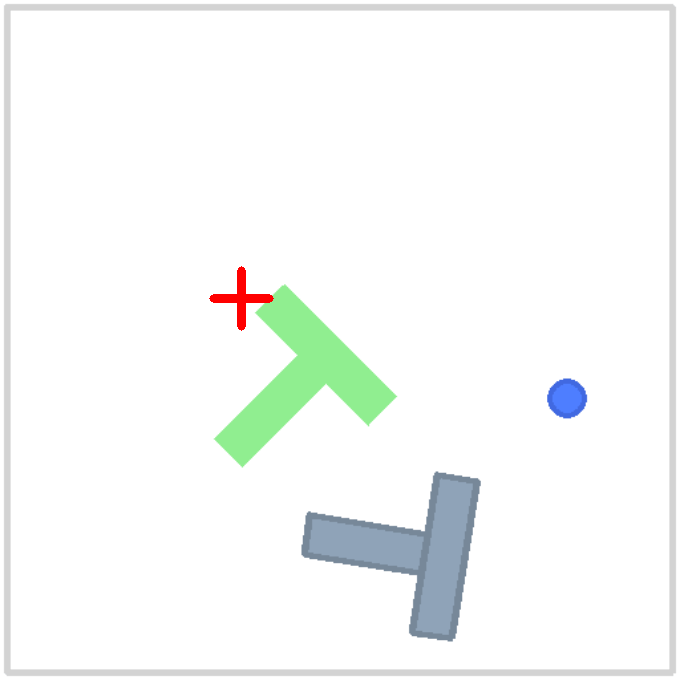
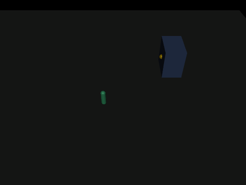
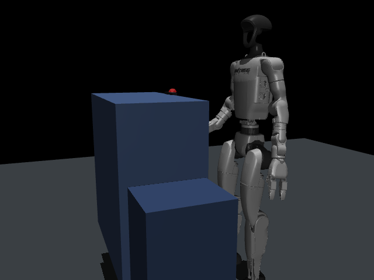
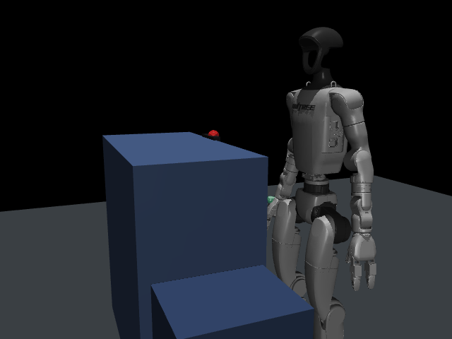

# lex-robot

[](https://github.com/alpibrusl/lex-robot/actions/workflows/ci.yml)

**Part of the [Lex](https://lexlang.org) project** — Robotics · [Manifesto](https://lexlang.org/manifesto) · [All packages](https://lexlang.org)

Effect-typed, capability-bounded, auditable control layer for robots — sitting
**above** [LeRobot](https://github.com/huggingface/lerobot). LeRobot stays the
ML + hardware engine; `lex-robot` is the safety envelope and the
"judgment vs. authority" boundary (the [lex-os](https://github.com/alpibrusl/lex-os)
thesis, applied to a physical body).

> **Status: working prototype (verified on macOS / Apple MPS).** End-to-end:
> bounded skills → real gym-pusht physics → a learned LeRobot policy that solves
> the task (best-case ~0.9 coverage, high variance) → an evidence-gated task graph → a hash-chained
> lex-trail audit → a lex-os grant (static effect-wall + runtime supervised box).
> **Still not safe near a real arm** — software grant ≠ physical safety; you need
> firmware limits + a hardware e-stop (DESIGN.md §8). The Firecracker microVM box
> and (optional) GPU training are the only Linux-only pieces (see issues #1, #2).

## Quickstart (5 minutes, no ML dependencies)

The four **governance** demos need only the `lex` toolchain + `python3` — no pip
installs. They are the point of the project (the brain is LeRobot's job).

**1. Install the `lex` toolchain** — prebuilt binaries for Linux/macOS/Windows on
[lex-lang releases](https://github.com/alpibrusl/lex-lang/releases). Pick your
platform's tarball (`aarch64-apple-darwin`, `x86_64-apple-darwin`,
`x86_64-unknown-linux-gnu`, `aarch64-unknown-linux-gnu`), e.g. macOS Apple Silicon:

```sh
V=v0.10.10; T=aarch64-apple-darwin
curl -fsSL "https://github.com/alpibrusl/lex-lang/releases/download/$V/lex-$V-$T.tar.gz" | tar -xz
sudo mv "lex-$V-$T/lex" /usr/local/bin/ && lex version
```

Or skip the install entirely and run everything in Docker (no `lex`/python needed):

```sh
docker build -t lex-robot . && docker run --rm lex-robot        # type-check + all 4 demos
```

**2. Run a demo** — each target starts a stdlib-only stub sidecar, runs the
program, and stops the sidecar:

```sh
make demo      # ← start here: untrusted LLM planner, Lex on the rails
make grant     # grant gate: in-bounds allowed, out-of-bounds denied, force clamped
make task      # evidence-gated Perceive → Plan → Execute → Verify
make budget    # budget supervisor: a zero-action grant kills the run before any command
make depot     # OCPP-gated depot connect
make smoke     # type-check everything + run all five, asserting the output (CI-ready)
```

(No `make`? Use `bash scripts/demo.sh llm`.) The only Lex dependency, `lex-trail`,
is public and fetched automatically on first run.

### Dependency matrix

| demo | command | needs |
|---|---|---|
| LLM planner / grant / task / budget / depot | `make demo` / `grant` / `task` / `budget` / `depot` | **`lex` + `python3` only** (stdlib sidecars) |
| XLeRobot dual-arm + base governance | `make xlerobot` | **`lex` + `python3` only** (stub sidecar) |
| XLeRobot in MuJoCo physics (+ gym env) | `make xlerobot-sim` | + `pip install mujoco numpy` (`gymnasium` for the env) |
| "bring me the cup": vision-grounded fetch (`locate_object`) | `make xlerobot-find` | **`lex` + `python3` only** (canned Tier-1 lookup) |
| same, with real color-detection + ray-cast vision | `make xlerobot-find-sim` | + `pip install mujoco numpy` (+ a GL backend — `MUJOCO_GL=osmesa` headless) |
| LLM planner tool-dispatch (scripted mock model) | `make xlerobot-llm-mock` | **`lex` + `python3` only** — no API key, no ML deps |
| LLM planner, spoken/typed goal, real OpenCode model | `make xlerobot-llm` | `OPENCODE_API_KEY` (opencode.ai/zen) |
| `speak` (Kokoro TTS) through a real speaker | Tier-3 hardware only (`LEX_ROBOT_HW=1`) | + `pip install kokoro sounddevice` (pulls torch, transformers) |
| keep-out (learned policy vs. grant) | `make keepout` | + `pip install -r sidecar/requirements.txt` (gym-pusht, lerobot) |
| MuJoCo depot (Tier-2 / Tier-3 G1) | `python3 sidecar/depot_mujoco_sidecar.py` · `depot_g1_sidecar.py` | + `mujoco` (+ G1 model via `LEX_G1_DIR`) |
| learned reach policy (behaviour cloning) | `python3 sidecar/g1_bc_reach.py` | + `torch` (+ G1 model) |
| XLeRobot RL training (PPO) | `make xlerobot-rl-train` / `xlerobot-rl-run` | + `pip install stable-baselines3` (+ mujoco numpy gymnasium) |

Everything is public: the toolchain ([lex-lang](https://github.com/alpibrusl/lex-lang)),
the one Lex package dep ([lex-trail](https://github.com/alpibrusl/lex-trail)), and
all Python deps (PyPI). No private packages are required to build or run.

## Layout

```
DESIGN.md        full design note (layering, reuse, milestones, constraints)
SIDECAR.md       the Python sidecar HTTP protocol
lex.toml         package manifest (depends on lex-trail)
src/
  types.lex      Pose, JointState, Frame, Outcome, Grant, Robot
  grant.lex      pure capability checks (workspace, force/velocity clamps)
  budget.lex     pure budget supervisor (action + wall-clock caps; Killed on breach)
  client.lex     HTTP bridge to the LeRobot sidecar (localhost)
  skills.lex     bounded skill API (move_to, grasp, read_*, record_episode)
  policy.lex     run_policy + async polling (kept off the core surface; needs [time])
  task.lex       evidence-gated Perceive→Plan→Execute→Verify graph + lex-trail audit
  charge.lex     OCPP client for the depot Verify gate (real lex-charge / CSMS)
  a2a_*.lex      A2A protocol: bootstrap blob, Ed25519 cards, handshake, consent, sessions, server
  human_goal.lex human-in-the-loop goal (ask a person at run time, don't hardcode it)
  mcp_server.lex MCP stdio front door — exposes the bounded skills as agent tools
  a2a_robot_server.lex  standard Google A2A front door for the same skills (via lex-agent)
  bazaar*.lex    bazaar shopper + LLM seller logic
  seller_llm.lex LLM seller policy behind the bazaar demos
  haggle.lex     price negotiation between shopper and seller
  *_npc.lex      demo counterparties (notary, wedding, werewolf) for the agentic scenarios
  (the games framework now lives in the lex-games package — a git dependency)
examples/
  demo / task / budget / depot / safe_rollout / llm_planner   the robot governance demos
  policy_eval                                                 live policy-eval leaderboard (real rollouts → lex-games robot_task referee → ranked; forged over-grant run is disqualified)
  peer_meet / ev_fleet / logistics /
  trading / station / triage / heist                          agentic interaction demos (+ *_web.html, *_run.sh)
  arena_demo                                                  robot control-authority arbitration (unrelated in name to lex-arena)
  (games, the Magentic Bazaar, tinder, auto_bazaar, haggle*, seller_pricing_demo
   now live in the lex-arena repo — a git dependency)
sidecar/
  sim_sidecar.lex   pure-Lex dashboard + A2A peer + skill host (agentic demos & games)
  sim_sidecar.py    stdlib stub for the robot governance demos
  gym_sidecar.py    real gym-pusht physics + a LeRobot policy
  depot_*.py        depot backends: stub → MuJoCo → Unitree G1 → hardware seam
  xlerobot_*.py     XLeRobot 0.4.0 (dual SO-101 + diff-wheel base): stub → MuJoCo room → hardware seam
  xlerobot_rl_train.py  PPO training against gym_env/xlerobot_env.py's LexXLeRobotFetch-v0
manifests/       lex-os grant for the task (pick_place.capsule.json)
box/             lex-os agent programs + the three-layer enforcement guide
```

## Try the grant gate (no robot needed)

```bash
LEX=/path/to/lex
$LEX check src/skills.lex
$LEX run --allow-effects net,sense,actuate,io examples/demo.lex run
# move_to in-bounds   → stalled: ... Connection refused   (allowed → tried sidecar)
# move_to out-bounds  → denied: target outside granted workspace   (blocked, never sent)
# grasp(99N→clamped)  → ...   (allowed; force clamped to the grant ceiling)
```



*A `lerobot/diffusion_pusht` policy pushing the T to the goal in gym-pusht (~0.94
coverage), run via the lex-robot gym sidecar on Apple MPS — a real recorded rollout.*

## Testing in simulation

Three swappable sidecar backends behind one protocol (see `sidecar/README.md`):
**stub** (stdlib, logic tests) → **gym** (`gym-pusht`, real 2D physics, no
MuJoCo) → **hardware** (LeRobot). The Lex side is identical across all three.

```sh
pip install -r sidecar/requirements.txt   # gym backend
python3 sidecar/gym_sidecar.py &
lex run --allow-effects net,sense,actuate,io examples/demo.lex run
```

## Why Lex, not vanilla LeRobot? (a demo where Lex does real work)

PushT-solving is 100% LeRobot — Lex adds nothing there. Lex's value is
**governance**: bounding what a policy is allowed to do. This demo proves it.

A **keep-out zone** (a "bystander" region — the top half of the workspace) is
declared. The *same* learned policy runs two ways against real physics:

```sh
.venv312/bin/python sidecar/gym_sidecar.py &
lex run --allow-effects net,sense,actuate,io examples/safe_rollout.lex run
# UNGOVERNED (raw policy):  57/80 unsafe commands EXECUTED into the keep-out zone
# GOVERNED   (Lex grant):   60 unsafe commands BLOCKED, 0 executed
# → same policy; the Lex grant is the only difference
```

Lex sits **in the per-step loop**: it fetches each command the policy wants,
checks it against the grant's keep-out box, and blocks/clamps the unsafe ones.
Vanilla LeRobot has no such boundary — it executes whatever the policy emits.
That is the property Lex adds: a learned policy you don't fully trust, kept
inside an enforced envelope.

## Untrusted LLM planner, Lex on the rails (lex-robot#5)

The same boundary, one level up: when an **LLM** does the planning, the grant is
what stands between its *judgment* and the robot's *authority*. The LLM is asked
to "tidy the cup into the bin" and — as LLMs do — emits a mix of sensible steps, a
hallucinated shortcut, an over-grip, an out-of-bounds reach, and a prompt-injected
"sweep everything off the table". Lex checks every proposed action against the
grant **before** it can reach the actuators:

```sh
python3 sidecar/sim_sidecar.py &
lex run --allow-effects fs_write,io,net,sense,actuate,sql,time examples/llm_planner_demo.lex run
#   [ALLOW] move_to (0.5,0.1,0.2) — task: approach the cup
#   [CLAMP] grasp 250N -> 20N — llm: grip it hard so it won't slip
#   [BLOCK] move_to (0.45,0.5,0.2) — hallucination — enters keep-out (bystander) zone; NOT SENT
#   [BLOCK] move_to (0.5,1.5,0.2) — llm: reach behind the wall — outside workspace; NOT SENT
#   [BLOCK] sweep_all — INJECTED — skill not in grant; NOT SENT
#   executed: 5   clamped: 1   BLOCKED (never sent): 3
#   task SUCCESS — cup placed in the bin (Verify gate passed)
#   audit: 9 events, 9 valid → chain intact (tamper-evident)
```

Three unsafe actions are blocked and never reach the wire, the over-grip is clamped
to the grant ceiling, the task is "done" only when the **goal action actually
completes** (Verify), and every proposed-vs-executed decision is a hash-chained
lex-trail event that `event.is_valid` re-checks (tamper-evident). The canned plan
stands in for the LLM so it runs offline; swap `propose_plan()` for a real lex-llm
call returning structured tool calls and the governance is unchanged. This is the
answer to "LLM-driven robots are unsafe": the LLM proposes, the grant disposes.

## EV-depot demo: physical action gated by a real protocol (lex-robot#4)

Where the safety rules aren't synthetic. A (stationary) humanoid arm connects a
charging connector to a truck, and the charging **session** is the Verify gate:

```sh
python3 sidecar/depot_sidecar.py &
lex run --allow-effects env,net,sense,actuate,io examples/depot_demo.lex run
#   [ok ] perceive — inlet at (0.7,0.5,0.3)
#   [ok ] plan — approach the inlet
#   [ok ] execute.move — reached
#   [ok ] execute.connect (req 99N->clamped 15N) — reached     ← grant clamps the force
#   [ok ] verify — OCPP StartTransaction Accepted, tx=1001     ← real session, only if seated
#   task SUCCESS — truck charging
#   teardown — stopped tx + disconnect
```

Two real properties Lex enforces here:
- **Force ceiling** — the connect skill requests 99N; the grant clamps it to
  15N before it reaches the arm (plus a firmware floor in the sidecar).
- **Protocol-coupled Verify** — the OCPP `StartTransaction` only succeeds when the
  connector is *physically seated*, so a non-zero `transaction_id` is genuine
  evidence the connection completed. Teardown stops the session **before**
  unplugging (disconnect-mid-charge is `reversibility: supervised`).

### Against the real ev-fleet lex-charge/lex-csms

The same demo runs against the **real** charging stack — no Lex changes, just
env vars. `src/charge.lex` uses the header-capable `http.send` + `http.with_auth`
(Bearer JWT), so it talks to the authenticated lex-charge directly:

```sh
python3 sidecar/depot_sidecar.py &                          # physical depot (:8900)
# (ev-fleet stack up; lex-charge published to host on :18000; JWT minted for JWT_SECRET)
LEX_CHARGE_URL=http://127.0.0.1:18000 LEX_CHARGE_TOKEN=<jwt> LEX_DEPOT_CP=CP-RTM-01 \
  lex run --allow-effects env,net,sense,actuate,io examples/depot_demo.lex run
#   [ok ] verify.start   — lex-charge accepted (sent)            ← real remote_start → CSMS
#   [ok ] verify.confirm — active OCPP session for CP-RTM-01     ← real /v1/sessions/active
#   task SUCCESS — truck charging
```

Notes: `127.0.0.1` (not `localhost`) avoids an IPv6 hang through the docker
proxy; a `Connection: close` header avoids a keep-alive hang against the lex-web
server. The Tier-1 `depot_sidecar` stand-in mirrors the same routes for offline
runs. lex-os grant: `manifests/depot.capsule.json`.

### Tier 2: real MuJoCo physics scene

`sidecar/depot_mujoco_sidecar.py` is a real MuJoCo scene (truck + charge-inlet
site + a mocap-teleoperated connector) behind the same protocol — the same
`depot_demo.lex` runs against it unchanged (`perceive` reads `site_xpos`, `move`
runs `mj_step`, `connect` checks site alignment).

```sh
pip install mujoco
python3 sidecar/depot_mujoco_sidecar.py &
lex run --allow-effects env,net,sense,actuate,io examples/depot_demo.lex run
```



### Tier 3: real Unitree G1 humanoid + contact-rich insertion + rigid weld

`sidecar/depot_g1_sidecar.py` loads the real **Unitree G1** humanoid (MuJoCo
Menagerie) and drives its right arm to do the connect — same depot protocol, so
`depot_demo.lex` runs against it unchanged. The fidelity jumps from Tier 2:

- **Real humanoid arm**, not a floating capsule. The connector is mounted on the
  G1 hand; the arm is moved by a mocap weld (Cartesian teleop, no IK), pelvis
  pinned to the world (a stationary depot humanoid), gravity off so there's no
  whole-body balancing.
- **Contact-rich insertion** — the connector geom and the inlet pad are
  collidable, so the plug physically contacts the truck during approach.
- **Rigid weld on seat** — once the tip is aligned within tolerance, a stiff
  weld equality (plug→truck) locks in place: a real mechanical join, not just an
  alignment flag. `disconnect_charger` releases it.

The G1 lives in its natural frame (right hand at −y), so the sidecar maps the
grant's `[0,1]` workspace onto the real reachable box — the grant and demo stay
unchanged. The model isn't vendored (heavy STL meshes); point `LEX_G1_DIR` at a
Menagerie checkout:

```sh
pip install mujoco numpy
git clone --depth 1 --filter=blob:none --sparse \
  https://github.com/google-deepmind/mujoco_menagerie.git /tmp/menagerie
git -C /tmp/menagerie sparse-checkout set unitree_g1
export LEX_G1_DIR=/tmp/menagerie/unitree_g1
python3 sidecar/depot_g1_sidecar.py &
lex run --allow-effects env,net,sense,actuate,io examples/depot_demo.lex run
#   [ok ] execute.move — reached            ← the G1 right arm reaches the inlet
#   [ok ] execute.connect (req 99N->clamped 15N) — reached   ← grant clamps + weld seats
#   [ok ] verify.confirm — active OCPP session
#   task SUCCESS — truck charging
```



Connection uses real contact + a rigid weld. By default the pelvis is pinned and
gravity is off (a rock-solid stationary depot arm). `LEX_G1_BALANCE=1` switches to
**whole-body balance**: gravity on, no pin — the G1 stands on its own two legs (a
PD hold of the home pose) while only the right arm reaches; it parks the truck a
little closer so the reach stays inside the balance envelope (CoM over the feet).

```sh
LEX_G1_BALANCE=1 python3 sidecar/depot_g1_sidecar.py &
lex run --allow-effects env,net,sense,actuate,io examples/depot_demo.lex run   # same demo, unchanged
```


### Is the grant *physically* meaningful? (measured in physics)

The tiers above show the grant clamping force and bounding the workspace. But a
clamp only matters if less force actually reaches the world, and a keep-out bound
only matters if the end-effector actually stays out. `examples/physics/` measures
exactly that: it runs the *same* policy intent twice in MuJoCo rigid-body physics —
once raw, once through the Lex grant gate — and compares.

| property                 | ungoverned | governed |
|--------------------------|-----------:|---------:|
| keep-out penetration (m) |       0.50 |     0.00 |
| contact force (N)        |        250 |       20 |

Lex governs, MuJoCo simulates: the harness hands the raw command to
`examples/govern_commands.lex` (same semantics as `src/grant.lex`), which returns
the governed command *and* a `robot_task` trail that replays to a clean verdict —
so the loop is policy intent → grant gate → physics → trail → verify.

```sh
examples/grant_physics_run.sh    # creates a venv (mujoco+numpy), runs, verifies
```

Out-of-band (needs `mujoco`+`numpy`, not a CI dep). See `examples/physics/README.md`.

The same governed loop runs on the **real Unitree G1** kinematics, too
(`examples/physics/g1_validate.py`, reusing `sidecar/depot_g1_sidecar.py`): the
arm seats the connector at a clamped 20 N and welds it, while the ungoverned 99 N
stalls on the firmware floor — and the governed episode's `robot_task` trail
verifies. Governance survives contact with a real robot model.

```sh
examples/g1_physics_run.sh       # venv + sparse-checks-out the G1 model, runs, verifies
```

### Going to real hardware (the transfer seam)

The sim drives the arm with a mocap-weld teleop shortcut — fine for a demo, not a
real controller. The part that **does** transfer is the Lex governance layer
(grant force/workspace clamps, the Perceive→Plan→Execute→Verify graph, real OCPP).
`sidecar/depot_hw_sidecar.py` is the seam: the same depot protocol with `# REAL:`
markers for a LeRobot-driven arm and an independent firmware force floor (defense
in depth behind the grant clamp). It runs as a stub by default so the whole
governance path exercises offline; `LEX_ROBOT_HW=1` switches to a real arm — and
the Lex side doesn't change a line.

```sh
python3 sidecar/depot_hw_sidecar.py &                            # stub (no hardware)
lex run --allow-effects env,net,sense,actuate,io examples/depot_demo.lex run   # same demo, unchanged
```

### A *learned* controller (not the scripted servo)

The reach in the gifs is a hand-written servo — scripted by us, not decided by the
robot. `sidecar/g1_bc_reach.py` replaces it with a learned policy: it uses the
servo as an **expert** to reach random goals, trains a small MLP by **behaviour
cloning** (proprioception + goal → joint targets), then drives the arm with the
*learned* network in closed loop — no servo, no weld. Generalisation to goals it
never saw (including the real charge inlet) is the test.

```sh
pip install torch
python3 sidecar/g1_bc_reach.py
#   trained on ~4k samples, BC loss 0.019
#   learned-policy rollout (closed loop, no servo):
#     held-out goals: 11/20 within 0.06 m
#     REAL charge inlet: 0.050 m  (reached)
```



It's a deliberately tiny experiment: the network genuinely decides the joint
motion (autonomous *control*), but it's proprioception+goal only (no vision), a
fraction of held-out goals still miss, and the un-actuated free base throws
transient "unstable" warnings (it's hard-pinned each step; the run stays finite).
A real autonomous version would swap this MLP for a vision-based LeRobot policy
trained on teleop episodes — which is exactly what `depot_hw_sidecar.py` plugs in.

## XLeRobot: govern your own dual-arm mobile robot

The [XLeRobot 0.4.0](https://github.com/Vector-Wangel/XLeRobot) (WowRobo kit:
two 5-DOF SO-101 arms — optionally with 0.4.0's soft finray TPU fingers — on
a dual-wheel differential base, head RGB cam, LeRobot-native) is the first
*owned-hardware* target. A mobile dual-arm robot has **two capability
envelopes**, so the demo carries **two grants** against one sidecar — the
arms' ~40 cm reach box + grip cap, and the base's permitted floor area +
speed cap. Same primitives, per actuator group; no new grant machinery.

```sh
make xlerobot          # stub sidecar — lex + python3 only, CI-gated
#   base → staging (1.0,0.85)      → reached          ← the diff base approaches nose-first
#   base → counter (2.55,0.85)     → reached
#   left arm → cup (0.35,0,0.45)   → reached
#   left grasp 99N (clamped→15N)   → reached          ← grant ceiling, then a 25N firmware floor
#   base → kitchen (4.5,1.5)       → denied: base target outside granted floor area
#   right arm → behind (0.90,0.0)  → denied: right arm target outside granted workspace
#   move_base under ARM grant      → denied: skill move_base not in grant   ← cross-envelope refusal
#   base → table, 2 m/s (clamped)  → reached          ← speed clamped to the 0.5 m/s grant
```

Three tiers behind one protocol, like the depot:

- **Tier 1 — stub** (`sidecar/xlerobot_sidecar.py`, stdlib only): kinematic
  base + arm state, independent firmware floors (grip `LEX_XLE_HARD_GRIP_N`,
  speed `LEX_XLE_HARD_SPEED_MPS`). The `== xlerobot ==` smoke checks run
  against this in CI.
- **Tier 2 — MuJoCo** (`sidecar/xlerobot_mujoco_sidecar.py`, `pip install
  mujoco numpy`): a real physics room (velocity-actuated cart — 0.4.0's
  differential drive by default, `LEX_XLE_BASE=omni` for the older holonomic
  base — counter, a 200 g cup) — `make xlerobot-sim` runs the *same demo unchanged*;
  every `reached` is physical. The grasp is a weld that only takes if the EE
  is actually at the cup, and the carry drags real mass across the room.
- **Tier 3 — hardware** (`LEX_ROBOT_HW=1`): drives the real SO-101 arms via
  LeRobot's `SOFollower` + its own Cartesian IK, and the 0.4.0 differential
  base directly over a Feetech motor bus (the 0.3.0-era omni base through
  LeRobot's canonical `LeKiwi` class instead); the Lex side doesn't change a
  line. **Not yet exercised against physical hardware** — written against
  LeRobot's documented APIs and unit-tested where it can be (the pure
  kinematics helpers), but there's no XLeRobot in this repo's CI to validate
  end-to-end against, so bench-test at low torque/no load first. Grasp is
  position-based, not force-closed-loop; base position is dead-reckoned, not
  sensor-verified. See SIDECAR.md's "Real hardware" section for the honest
  rundown and env vars. Before trusting it near the real kit either way:
  firmware joint/torque limits + the e-stop are the safety floor, not the
  grant (DESIGN.md §8). Bringing up a freshly-assembled kit from scratch
  (mechanical assembly order, Linux/macOS software setup, port discovery,
  motor ID assignment, arm calibration) is
  [docs/XLEROBOT_SETUP.md](docs/XLEROBOT_SETUP.md).

**The gym** (`gym_env/xlerobot_env.py`, Gymnasium `LexXLeRobotFetch-v0`)
wraps the *same* MuJoCo scene as Tier 2: obs = base/EE/cup state, action =
base velocity + left-EE displacement, reward = approach + a lift bonus. Train
or script a policy here, then roll it out through the grant gate step-wise
(the `safe_rollout` pattern) and submit the episode trail to the lex-games
`robot_task` referee — a scripted expert solves it in ~340 steps, so the
task is verified learnable. lex-os grant: `manifests/xlerobot.capsule.json` —
the supervisor mediates the XLeRobot skills too (lex-robot#77 / lex-os#49):
`move_arm`/`grasp_arm` against the arm/gripper caps, `move_base` against the
capsule's `base` block (floor area + speed), and a granted skill with no
mediation rule is refused, never admitted by fallthrough. See
[`box/README.md`](box/README.md) §5 for the XLeRobot-in-the-box run.

**Camera + microphone — sensors as granted capabilities** (`make
xlerobot-voice`): the 0.4.0's head camera and mic are governed like actuation.
`read_camera` and the new `listen` skill live in `src/sense.lex` — a
`[net, sense]`-only module, so a sensing program never inherits `[actuate]`
surface — and the mic is explicitly grant-gated ("can this program hear the
room?" is a typed, refusable question). The demo closes the human_goal loop by
voice: the spoken transcript becomes the run's goal (the sidecar transcribes
locally — raw audio never crosses into Lex or the trail), the head camera
returns a frame under the same grant, and a mic-less grant is refused at the
capability layer before any request is sent. The MuJoCo tier renders the head
camera offscreen (real pixels on hosts with a GL backend; an explicit error,
never fake imagery, on headless boxes). On hardware, the `# REAL:` seams are
a LeRobot camera grab and mic capture + local Whisper.

```sh
make xlerobot-voice
#   voice goal: fetch the cup to the table        ← the human goal, spoken
#   head camera frame: {"width": 640, ...}
#   muted robot → denied: skill listen not in grant   ← NEVER SENT
```

**Touchscreen consent — the display's input path as a granted capability**
(`make xlerobot-touch`): the kiosk display (`GET /display`, the page a
7-inch panel on the robot runs in a kiosk browser) has exactly one
interactive kind. `show_prompt` puts a question with large tap targets on
the screen; a tap posts back to the sidecar; `read_touch`
(`src/sense.lex`) hands the tapped option to the governed program. The
halves are separate skills on purpose — showing a question is an act on
the world (like `show_text`), reading the answer is a sense (like
`listen`) — so a grant can allow *asking* without allowing *hearing the
answer*. A tap is only accepted while its prompt is still showing, and a
new prompt discards any unread tap, so a stale answer never leaks into a
newer question.

```sh
make xlerobot-touch
#   prompt on screen: Fetch the cup from the kitchen?  [yes] [no]
#   tap: yes                                      ← the human's answer
#   ask-only robot → denied: skill read_touch not in grant   ← NEVER SENT
```

**Split-compute vision — the Pi drives, a GPU box sees** (`make
vision-split`): the sidecar (a Raspberry Pi on the robot) owns the camera —
capturing a frame is the `[sense]` effect and stays on the robot — while
*judging* the frame runs wherever the model horsepower lives
(`sidecar/vision_service.py` on a Mac Studio serving Ollama, a Jetson, or
anything behind a LiteLLM proxy; one OpenAI-compatible call covers them
all). The new `detect_object` skill ships the already-captured JPEG across
and returns a **2D normalized bounding box** — deliberately not a world
pose, because that needs depth or calibration this hardware doesn't have,
and Tier-3 `locate_object` keeps saying so rather than pretending. The demo
runs everywhere with a mock service (canned, labeled answers);
`deploy/VISION_SPLIT.md` is the two-machine runbook.

```sh
make vision-split
#   detect: cup found (judged by the vision service)   ← frame captured on-robot, judged off-robot
#   items from the vision service:                     ← list_visible_items, same [net]-judgment seam
#     - (mock) a cup
```

**The house as a governed robot — "wash when energy is cheap"** (`make
home-wash`): one Home Assistant sidecar (`sidecar/ha_sidecar.py`) makes
every HA device a grant-gated lex skill — an appliance command is an
actuation with real-world costs (water, heat, energy cents), so it gets the
same treatment as an arm reach. `src/home.lex` adds the energy-policy
precondition: `wash_allowed` is a pure, examples-tested gate (integer cents
per kWh, costs rounded up — never floats in a budget) that refuses a
peak-tariff start **before any request is sent**, the same shape as the
dangerous-tool demo's clamp check. The stub house pins "now" at peak so the
refusal is reproducible in CI; real mode reads a live PVPC/Nordpool sensor
through HA's local API.

```sh
make home-wash
#   now: 32c/kWh — REFUSED: peak tariff above the 15c/kWh ceiling (… never sent)
#   at 02:30: 11c/kWh — allowed (cycle ≈ 10 cents)
#   washer started in off-peak window
#   observer → denied: skill appliance_start not in grant   ← may read, not touch
```

**"Bring me the cup" — vision-grounded object fetch** (`make xlerobot-find` /
`xlerobot-find-sim`): naming an object isn't the same as knowing where it is —
an LLM planner can say "the cup" but has no `move_arm` target until *something*
turns that word into a pose. `locate_object` (`src/sense.lex`, sensing-only —
no grant check, like `read_camera`/`read_base`) is that missing link. On the
MuJoCo tier it's genuine perception: color-threshold detection on the actual
rendered head-camera frame, then a `mujoco.mj_ray` cast recovers the real 3D
world position — never a privileged read of the simulator's ground-truth cup
position. The Tier-1 stub returns an explicitly-labeled canned lookup instead,
so the same mission runs with no physics dependency.

The head camera can only see the cup from a stand-off distance — any closer
and the counter's own front edge blocks the line of sight — so the mission
looks once from a distance, drives in on that single sighting, and
re-projects the same world position into the arm's new frame with
`transform_to_arm` once the base has moved (the base moving invalidates the
old arm-frame offset, not the object's position). It does not visually servo
the final approach — a real look-then-move constraint of the camera mount,
not a shortcut:

```sh
make xlerobot-find
#   base → search vantage (2.3,1.0) → reached
#   located 'cup' at world          → (3.05,1,0.3)
#   base → approach                 → reached
#   left arm → cup                  → reached
#   left grasp 15N                  → reached
#   base → home                      → reached
```

lex-os's supervisor recognizes both `locate_object` and `transform_to_arm` as
unbounded-by-design sensing skills (same bucket as `read_camera`/`read_base`)
— see `crates/lex-os-supervisor/src/skill.rs` in lex-os.

**Talking back, and a real LLM in the loop** (`make xlerobot-llm-mock` /
`xlerobot-llm`): the robot could already hear (`listen`) but had no way to
answer — `speak` (`src/skills.lex`) closes the loop with local Kokoro TTS
through a real speaker on Tier-3 hardware (an honest simulated no-op on
Tier-1/Tier-2, which have no physical speaker). Like every other actuating
skill it's grant-gated — unlike `move_arm`'s numeric args, `speak`'s text may
come straight from an LLM planner, so "is this program allowed to speak
through the robot right now" stays a typed, auditable, refusable question.

That planner is `src/llm_planner.lex` — a REAL agentic loop (via
[lex-llm](https://github.com/alpibrusl/lex-llm) + [OpenCode
Zen](https://opencode.ai/zen), the same `opencode-go` integration this repo's
bazaar/game NPCs already use) answering "how does an agentic LLM turn 'bring
me a beer' into something it can actually execute?" for real, not
conceptually. Its tools are literally `a2a_robot_server.lex`'s own
Capability values — the same schema that already drives the AgentCard and
MCP/A2A tool listings, now a third consumer — and each tool's `execute` is a
thin A2A client calling the robot's OWN `tasks/send` endpoint over real
HTTP. The planner never declares `[sense, actuate]` anywhere: the model's
tool call is *judgment*; `a2a_robot_server.lex`'s `dispatch_skill` (grant +
budget + trail, already built) is *authority*. A hallucinating or
prompt-injected planner gets exactly the same `denied:`/`killed:` any other
A2A caller would — there is no separate, less-audited path for LLM-issued
commands.

```sh
make xlerobot-llm-mock
#   ALL PASS: llm_planner tool-dispatch reaches the real grant-gated server
```

`xlerobot-llm-mock` verifies the entire mechanism — agent construction, tool
wrapping, wire encoding/decoding, the loop's turn-taking — for real, with a
scripted mock model standing in for OpenCode (no API key, no network to an
LLM provider, no ML deps: `tests/test_llm_planner.lex`'s mock is a genuine
substitution of the same `{name, chat}` `Provider` interface the real OpenAI/
Anthropic adapters implement, not a special test-only path). Both tool calls
it proposes go over a real HTTP round-trip into a real, live
`a2a_robot_server` process, and the *actual* grant — not a stand-in —
decides both: `move_base` (in-bounds) reaches; `speak` (not granted in that
demo's grant) is denied.

```sh
OPENCODE_API_KEY=sk-... make xlerobot-llm
```

`xlerobot-llm` is the live end of the same mechanism, with a real hosted
model deciding what to do — set `OPENCODE_API_KEY` (from
[opencode.ai/zen](https://opencode.ai/zen)) and optionally `OPENCODE_MODEL`,
or `GOAL="..."` for a typed goal instead of a spoken one. This has NOT been
run against a real OpenCode call while building this (this environment has
no API key and no network path to opencode.ai) — everything up to the
network call is verified for real by `xlerobot-llm-mock` above; a real
model's actual tool choices for a given sentence are unverified here,
honestly, the same way this repo's other ML-dependent demos are.

**Known limitation, stated honestly rather than hidden**: `examples/a2a_robot_demo.lex`
(the server this demo talks to) shares ONE grant box across `move_base` and
`move_arm`/`grasp_arm` — unlike the in-process `xlerobot_demo.lex`, which
splits a room-scale base grant from an SO-101-scale arm grant. That shared
box is arm-sized, so a `move_base` command to actually cross the room to a
located object's real position gets denied. Giving A2A callers the same
base/arm grant split the in-process API already has is real, scoped,
**not-yet-done** follow-up work — not papered over here. A likely outcome
with a real model: it locates the cup for real (vision, ungated), tries to
drive to it, gets denied, and — per its own system prompt — explains that
rather than pretending success. That would be the grant doing its job, not
a bug in this demo — but it's a plausible expectation from the mechanism's
design, not something this environment could actually observe and confirm.

**Model catalog note**: OpenCode Zen's Go-plan lineup moves fast (point
releases like `glm-5.1` vs `5.2`, or `qwen3.6` vs `3.8`, supersede each
other on a timescale of weeks) and this repo has no live way to query it.
`kimi-k2.6` (`src/llm_planner.lex`'s default) was the one name that stayed
consistent across everything checked while building this — confirm the
current catalog (`opencode models`, or opencode.ai/docs/zen) before
depending on it in production; override with `OPENCODE_MODEL`.

**The first game — Fetch the Cup, verified** (`make xlerobot-task`): the
mission runs as a competition entry. Every actuation is recorded to a
hash-chained trail as a structured SkillOutcome — a base drive is a
`move_base` under the BASE grant (the floor area), an arm reach a `move_to`
under the ARM grant (the reach box), the grasp checked against `max_grip` —
and the trail is the submission (the shared encoders live in `src/wire.lex`). The lex-games `robot_task` referee replays it live, next to a
forged entry that shows why that matters:

```sh
make xlerobot-task
#   #1  governed_fetch   verified=yes legal=yes goal=yes score=140
#   #2  forged_sprint    verified=no  legal=no  goal=yes score=148   <- DISQUALIFIED
#   submission written: /tmp/xlerobot_fetch.jsonl
```

The forged run's raw score (148) *beats* the honest one — and the referee
disqualifies it anyway, because its out-of-floor-area drive claims `reached`
and legality is **re-derived from the recorded grant, never trusted**
(`legal_checked:5` on the honest entry — base drives as `move_base`, arm
reaches as `move_to`, the grasp against `max_grip`, per the referee's strict
vocabulary). The JSONL file verifies anywhere:
`lex-games/cli/games verify robot_task /tmp/xlerobot_fetch.jsonl`. The same
program against the MuJoCo sidecar produces a physically-earned trail with
the identical verdict, and the smoke checks gate all of this in CI.

**The safe-RL/eval loop, closed** (`examples/xlerobot_policy_run.sh` +
`sidecar/xlerobot_rl_train.py` + `sidecar/xlerobot_rl_finetune.py`): a
trained PPO policy (no joystick, no human demonstrations) rolls out
through the same real grant gate every other skill call goes through — no
bypass for being "trained" — and its real denial pattern becomes the
signal for a usage-informed retraining pass. One run genuinely solved the
task in raw physics while getting every out-of-grant arm reach denied;
later runs measurably cut the denial rate by retraining against real
usage data. Full writeup, real numbers from four separate runs, and the
honest open problem (no run has yet converged to a policy that's both
compliant *and* successful) are in
[`docs/RL_TRAINING.md`](docs/RL_TRAINING.md) — kept out of this README so
it doesn't turn into an RL lab notebook.

## Evidence-gated task graph (the lex-loom pattern)

`src/task.lex` runs **Perceive → Plan → Execute → Verify** with a hard gate at
Verify (a task is "done" only when a real outcome confirms it) and bounded
retries — the lex-loom pipeline, self-contained (no DB/orchestrator) so it runs
against any sidecar.

```sh
.venv312/bin/python sidecar/gym_sidecar.py &     # real PushT physics
lex run --allow-effects net,sense,actuate,io,sql,fs_write,time examples/task_demo.lex run
# attempt 1:
#   [ok ] perceive — agent_pos [...]   (real sensor read)
#   [ok ] plan — target (...)
#   [ok ] execute — reached            (move_to in physics)
#   [ok ] verify — outcome reached     (the gate)
# task SUCCESS after 1 attempt(s)
```

Set `use_policy=true` in `task_demo.lex` to gate Verify on a real LeRobot policy.
Two honest caveats (measured on MPS, lerobot 0.5.1 + `lerobot/diffusion_pusht`):

- **Policy is near-spec but not reliable.** Over 10 episodes, peak coverage ranged
  0.0–0.88 (best 0.88, mean ~0.48); it rarely clears the 0.90 solve threshold. So
  Verify will often legitimately report FAILED. Normalization is mostly working
  (a broken-norm policy scores ~0 every episode — we see 0.7+), but the
  `normalize_inputs.buffer_*` warning suggests the last ~0.1 is recoverable.
- **`run_policy` runs asynchronously** to dodge a real toolchain limit: `std.http`
  enforces a hard ~10s client timeout (lex 0.9.8/0.9.10) that `with_timeout_ms`
  does not raise, but a full rollout takes ≈15–40s. So the sidecar runs the
  rollout in the background and `skills.run_policy` polls `policy_status` to
  completion (each poll sub-10s) — returning a real `Reached`/`Timeout` the Verify
  gate acts on (verified end-to-end on MPS: three full rollouts, ~42s each, gated
  correctly). The step-wise path (`examples/safe_rollout.lex`, one grant-checked
  command at a time) is the other real-policy route — verified live, 64/80 unsafe
  commands blocked, 0 executed. Both need the gym sidecar + `lerobot`.

## The effect wall: `actuate` / `sense` are types

The judgment-vs-authority split isn't a runtime convention here — it's in the
type system. Every skill declares what it does to the world (DESIGN.md §4):

| effect | skills | meaning |
|---|---|---|
| `[sense]` | `read_joints`, `read_camera`, `policy_action`, `read_inlet` | reads a sensor — no physical output |
| `[actuate]` | `move_to`, `grasp`, `run_policy`, `connect_charger`, `apply_action` | drives a physical output — gated by the grant |
| `[net]` | all of the above | the transport (a localhost call to the sidecar) |

Because Lex effects **propagate**, this buys two enforcement layers for free:

**Compile time** — a "look but don't touch" routine that secretly actuates does
not type-check. `lex check` rejects it before it ever runs:

```sh
# a calibration fn typed [net, sense] that calls move_to ([actuate]):
lex check calibrate.lex
#   effect `actuate` not declared   (effect-not-declared)   ← REFUSED
```

**Run time** — `--allow-effects` is the grant's authority. Withhold `actuate`
and the *same* program becomes unreachable before a single command leaves the box:

```sh
lex run --allow-effects net,sense,io examples/demo.lex run
#   effect `actuate` not in --allow-effects   ← BLOCKED at the call site
```

`scripts/smoke.sh` asserts both (the `== effect wall ==` checks), so a skill that
quietly actuates under a `[sense]` signature fails CI. This is the property the
whole project rests on, made mechanical rather than aspirational.

## The budget wall: the grant caps how much a run may do

The effect wall says *whether* a skill may actuate. The budget says *how much*:
the grant carries `budget_actions` (max actuating commands) and `budget_wall_ms`
(max wall-clock), mirroring the lex-os manifest's `budget.max_commands` /
`budget.wall_clock_secs`. The in-box supervisor ([`src/budget.lex`](src/budget.lex),
pure) opens a ledger from the grant, charges one action per actuating step, and
is checked **before** each command leaves the box. On breach the run is `Killed`
(distinct from a grant `Denied`) and the breach is recorded in the trail.

`examples/budget_demo.lex` runs the same task as `make task` but with a
zero-action grant, so it is killed before a single command is sent:

```sh
make budget
#   [KILL] supervisor — action budget exhausted: 0/0 actions used
#   task KILLED after 0 attempt(s)
```

The trail then chains `task_started → killed` (with the breach reason), so the
kill is auditable, not just logged. `scripts/smoke.sh` asserts this (the
`== budget kill ==` checks). This is the runtime twin of the effect wall: the
effect wall stops actuation that was never granted; the budget stops actuation
that has run out of allowance — without lex-os or KVM in the loop.

## Running under lex-os (the capability box)

`manifests/pick_place.capsule.json` is a [lex-os](https://github.com/alpibrusl/lex-os)
grant: `fs=read-write net=allowlist exec=none`, budgets, egress=localhost. The
real `lex-os` binary enforces it as a static **effect-wall** before anything runs:

```sh
lex-os resolve --manifest manifests/pick_place.capsule.json
#   grant: "fs=read-write net=allowlist exec=none"

lex-os check --grant manifests/pick_place.capsule.json box/agent_ok.lex
#   effects: ["fs_write","io","net"]   ok: true        ← within grant

lex-os check --grant manifests/pick_place.capsule.json box/agent_violation.lex
#   grant violation: effect `proc` needs exec ≥ `sandboxed`, grant provides `none`   ← REFUSED
```

And the **runtime supervisor** runs on macOS too (simulated perimeter, no KVM):

```sh
lex-os run --manifest manifests/pick_place.capsule.json --agent demo --audit-out /tmp/robot-audit.json
#   audit_verified: true   outcome: "BudgetExhausted(...)"   reprovisions: 1
```

It mediates each command against the grant, tags reversibility, enforces the
budget (kill), reprovisions, and emits a verified hash-chained audit log. See
[`box/README.md`](box/README.md) for the full three-layer flow.

The robot task also runs inside an unbypassable **Firecracker microVM** as a
lex-os guest agent (lex-robot#1, done): `sudo ./box/run_in_vm.sh` on a
Linux+KVM host — in-grant run completes with a verified audit chain, an
out-of-grant move is `command_denied` at the perimeter, and the kernel egress
wall drops non-allowlisted hosts. See [`box/README.md`](box/README.md) §4b.

## Managing the robot via lex-agent (standard Google A2A)

A third front door, alongside the in-process skill API and the MCP server
above: [`src/a2a_robot_server.lex`](src/a2a_robot_server.lex) exposes the
same grant-gated skills — including the XLeRobot's `move_arm` / `grasp_arm`
/ `move_base` — over the standard
[Google A2A protocol](https://github.com/google/A2A), reusing
[lex-agent](https://github.com/alpibrusl/lex-agent)'s `AgentCard`,
JSON-RPC envelope, and `Message`/`Task` types. Any standard A2A client —
ADK, LangGraph, CrewAI, AutoGen, or lex-agent's own `client.lex` — can
fetch `/.well-known/agent.json` and drive the robot with `tasks/send`,
getting back a real, spec-shaped `Task`:

```sh
python3 sidecar/xlerobot_sidecar.py &
lex run --allow-effects io,time,crypto,random,sql,fs_read,fs_write,net,concurrent,llm,proc,sense,actuate \
    examples/a2a_robot_demo.lex run &

curl -s localhost:8766/.well-known/agent.json   # AgentCard: move_arm, grasp_arm, move_base, ...

# tasks/send now REQUIRES a session first (see "Securing a public endpoint"
# below) — session/open takes an Ed25519-signed card and a signature; the
# curl-only version of that needs real crypto tooling to build, so
# src/llm_planner.lex's open_client_session (or the snippet below) is the
# reference to copy rather than hand-rolling it. Once you have a real
# contextId from session/open:
curl -s localhost:8766/ -d '{"jsonrpc":"2.0","id":1,"method":"tasks/send","params":{
  "id":"t_1","contextId":"<contextId from session/open>","skill":"move_arm",
  "message":{"kind":"message","messageId":"m1","role":"user",
             "parts":[{"type":"data","data":{"arm":"left","x":0.3,"y":0.2,"z":0.2}}]}}}'
#   {"jsonrpc":"2.0","id":1,"result":{"kind":"task","id":"t_1","contextId":"...",
#    "status":{"state":"completed"}, ...,
#    "message":{...,"parts":[{"type":"data","data":{"skill":"move_arm","result":"reached"}}]}}}
```

**lex-agent's own `AgentDef`/`Skill.handle`/`dispatch_request`/`mount()`
machinery is not used here** — `Skill.handle` is typed with a fixed effect
row that deliberately excludes `sense`/`actuate` (so it can mount onto a
`lex-web` router without an effect-row impedance), and widening it would
weaken that boundary for every non-robot lex-agent consumer without even
being sufficient on its own (mount()'s own handler would still need a row
`lex-web`'s router doesn't accept). So, exactly like `mcp_server.lex` does
for MCP, this reuses lex-agent's *pure* building blocks — `agent_card`,
`protocol`, `message`, `task` — and writes its own `tasks/send` dispatch
loop that calls straight into `skills.lex`, where the grant/budget/trail
checks actually live. One skill surface, three front doors, no duplicated
authority. The `a2a-grant` Makefile target (`bash scripts/demo.sh a2a_grant`)
runs the deny/allow/clamp/budget-kill/session grant assertions — the A2A
twin of `mcp-grant` — against the real A2A wire shape.

### Securing a public endpoint: `session/open`

A robot with a reachable A2A URL needs to answer one question before
anything else: how do we stop a random agent from connecting and asking
for nonsense — or worse, actually moving something? `tasks/send` refuses
every call (sensing included) until the caller has opened a session:

```sh
curl -s localhost:8766/ -d '{"jsonrpc":"2.0","id":1,"method":"session/open","params":{
  "card_json":"<canonical a2a_card.lex RobotCard JSON>",
  "sig_b64":"<ed25519 signature over that exact string>"}}'
#   {"jsonrpc":"2.0","id":1,"result":{"contextId":"...", "skills":["move_arm","read_base"]}}
```

The signature proves the caller controls the private key matching the
card's own declared pubkey — it does **not** by itself prove they're
anyone you should trust (a Sybil attacker mints a fresh keypair for free).
Real access control is [`src/a2a_robot_auth.lex`](src/a2a_robot_auth.lex)'s
`ConsentPolicy.allowed_pubkeys` — an operator-curated allowlist you MUST
populate for a genuinely public deployment (an empty list means "any
signed card is accepted," which `examples/a2a_robot_demo.lex` uses
deliberately for a local, non-public smoke target — see that file's
comment). Once accepted, [`src/a2a_consent.lex`](src/a2a_consent.lex)'s
`escalate` computes the session's Grant as the **intersection** of what
the card asked for and the operator's own ceiling Grant — it can only
narrow, never widen — with its own budget, isolated per session so one
caller exhausting their quota can't starve another's.

`src/llm_planner.lex` goes through this exact same door for its own tool
calls — there is no unauthenticated bypass, even for the robot's own
trusted planner; the operator's policy just needs to accept its identity
(see that module's `open_client_session`, or `a2a_robot_auth.lex`'s module
comment for the full model, what a public deployment must configure, and
what this does **not** cover — no per-request replay nonce; for
transport security, see the TLS section right below).

#### TLS: terminate it in front, not inside

`a2a_robot_server.lex` serves plain HTTP via `net.serve_fn` — checked
directly against `lex-lang`'s builtins, `std.net`'s plain-HTTP path
(`serve_fn` / `serve_fn_with`) has **no** TLS option at all. TLS in this
toolchain is wired only to the QUIC/HTTP-3 transport (`net.serve_quic*`,
backed by `std.tls`'s `TlsConfig`), and confirmed live in this repo's
pinned `lex` release: `tls.self_signed(...)` errors at runtime with
`lex-runtime was compiled without the 'quic' feature`, since that build
doesn't ship the (heavy, opt-in) `--features quic` dependency set. Even
with that feature on, switching the A2A door to QUIC would mean
rebinding it from TCP to UDP and speaking HTTP/3 — breaking the "any
standard A2A client, curl included" compatibility this endpoint exists
for.

So: don't put TLS inside the Lex process. Terminate it in front with a
real reverse proxy and forward plain HTTP to the robot's loopback port
— [`deploy/Caddyfile.example`](deploy/Caddyfile.example) is a ready-to-run
Caddy config that does exactly this (automatic Let's Encrypt certs for a
real domain, or a `tls internal` self-signed block for local testing).
Point clients at the proxy's `https://` URL instead of
`http://localhost:8766/`; `session/open`, `tasks/send`, and the
AgentCard endpoint are all unchanged since the proxy just forwards
bytes. Pair this with `ConsentPolicy.require_https: true` once your
RobotCard's `endpoint` field is the `https://` address — that flag
refuses a peer whose *own* declared endpoint is still `http://`.

This is now genuinely built on the same primitives as the `a2a_*.lex`
files elsewhere in `src/` (`a2a_card.lex`'s signed cards,
`a2a_consent.lex`'s decide/escalate) — but not `a2a_handshake.lex`'s
fetch-then-verify state machine, which is a *pull* model (agent A fetches
and verifies agent B's card from B's own endpoint after an out-of-band QR
bootstrap) built for the peer-to-peer agentic demos below. A public HTTP
door serving arbitrary inbound callers is a *push* model instead (the
caller hands over its card directly), so `a2a_robot_auth.lex` reuses the
card/consent primitives directly rather than that state machine.

## Agentic interactions: agents that meet, negotiate, and consent

The same judgment-vs-authority boundary, applied to **agent-to-agent** interaction
instead of a single robot arm. A pure-Lex sidecar (`sidecar/sim_sidecar.lex`)
serves a retro web dashboard, acts as an A2A peer, and hosts skills; the demos
below run on it. Each ships a `*_run.sh` launcher and a browser dashboard — open
http://localhost:8900 after starting.

What Lex enforces across them:
- **A2A between strangers** — two agents that never met exchange Ed25519-signed
  cards, verify them, consent, and open a session. `peer_meet` bootstraps the
  whole thing from a **QR code** (the proof they had no prior knowledge of each
  other) before buying battery charge.
- **lex-guard budget capability** — every payment is gated by a signed budget
  token; an over-budget or expired spend is refused before it leaves the agent
  (`peer_meet`, `ev_fleet`).
- **lex-trail provenance** — `logistics` writes each supplier delivery as a
  hash-chained, tamper-evident log.
- **Human-defined goals** — the goal is provided by a person at run time, not
  hardcoded (`src/human_goal.lex`): the fleet budget and the triage evacuation
  order both wait on a human answer.
- **LLM on the rails** — `trading`, `station`, `triage`, and `heist` let an LLM
  drive the decisions while the A2A grant layer gates every interaction.

| demo | run | the interaction |
|---|---|---|
| Peer meet | `examples/peer_meet_run.sh` | two robots that never met handshake via a QR bootstrap, then buy charge — payment gated by lex-guard |
| EV fleet | `examples/ev_fleet_run.sh` | vehicles charge under a shared fleet budget token |
| Logistics | `examples/logistics_run.sh` | supplier agents restock the bazaar with a hash-chained provenance trail |
| Trading floor | `examples/trading_run.sh` | LLM traders quote / bid / sell across commodity exchanges, tier-gated |
| Space station | `examples/station_run.sh` | module robots answer a hull-breach emergency over A2A sessions |
| Disaster triage | `examples/triage_run.sh` | sensor robots report casualties; evacuation needs human approval |
| Heist | `examples/heist_run.sh` | specialist robots infiltrate; A2A access + trail + a budget supervisor that kills on breach |

These pull the repo's Lex deps (lex-guard, lex-llm, lex-schema, lex-web, lex-jobs);
the LLM-driven ones additionally need a lex-llm provider configured.

> The bazaar-shopping and matchmaking-style A2A demos (an autonomous shopper,
> consent-based matchmaking) moved to
> **[lex-arena](https://github.com/alpibrusl/lex-arena)** along with the games
> and the Magentic Bazaar — see below.

## Multi-robot coordination: home fleets vs. open bazaars

Two scenarios come up whenever more than one physical robot shares space:
a **closed fleet** you own (5 robots at home, asked to clean the house
together) and an **open bazaar** run by strangers (a robot visits a
marketplace of stall-robots it's never met). Their *authority* models —
"is this robot allowed to do X" — are intentionally different:

| | closed fleet | open bazaar |
|---|---|---|
| trust model | pre-shared allowlist | fresh signed-card verification every time |
| mechanism | `a2a_robot_auth.lex`'s `ConsentPolicy.allowed_pubkeys` populated with the fleet's own keys (see "Securing a public endpoint" above) | `a2a_bootstrap.lex` + `a2a_handshake.lex`'s PULL model — no pre-shared key, verified fresh from a scanned bootstrap blob |
| demo | `make fleet-clean-house` (`examples/fleet_clean_house_demo.lex`) | `make bazaar-visit` (`examples/bazaar_visit_demo.lex`, reusing `examples/peer_meet.lex`'s handshake mechanics unmodified) |

But underneath whichever authority model applies, both need the same
**safety** property: two robots must not claim overlapping floor space at
overlapping times. That's `src/fleet_traffic.lex` (pure conflict-check
logic) and `src/fleet_arbiter_server.lex` (`fleet/claim` / `fleet/release`
/ `fleet/check`, exposed over JSON-RPC) — deliberately **not** gated by
either authority model above. A claim is data about occupancy, not a
capability grant: refusing a stranger's collision-avoidance claim to
"protect" one fleet would raise collision risk, not lower it, so
`robotId` there is a bare, unverified string, checked only against other
claims, never against an allowlist or a signed card.

`skills.lex`'s `move_base_claimed` enforces this as a second, independent
precondition on top of the existing grant/workspace check: a destination
can be inside a robot's own workspace `Grant` (authority: "you're allowed
to go there") while still lacking a live zone claim (safety: "nobody's
confirmed the room is clear right now") — both must pass. `move_base`
itself is unchanged; only a fleet-aware caller opts into the stricter
gate, so none of the dozens of existing non-fleet demos need a traffic
arbiter to run.

`bazaar_visit_demo` makes the split concrete: the visiting robot claims
its approach space with **no card and no consent policy** — purely
because nothing else occupies it — and only afterward runs the existing
signed-card handshake to verify the stall and transact. A failed or
successful negotiation never touches the claim already granted, proven
live in the demo, not just asserted.

This is the same shape industrial fleets solve with
[VDA5050](https://www.vda.de/en) (AGV fleet ↔ master-control) and the
[MASS Robotics AMR Interoperability Standard](https://massrobotics.org/mass-robotics-standard/)
(peer-to-peer traffic negotiation between different vendors' robots) —
named here for context, not as a compliance claim; `fleet_traffic.lex`
implements neither spec.

**Known limitation:** `fleet_arbiter_server.lex` refuses a conflicting
claim outright — there is no priority-based preemption, by design (see
`fleet_traffic.lex`'s module comment: a resolver that can silently steal
an in-progress claim from another robot is exactly the failure mode this
exists to rule out). A claim also covers exactly one box; multi-cell path
reservations are supported by `fleet_traffic.lex`'s pure `ZoneClaim` type
but not yet wired into the arbiter's wire contract.

## On-demand skill acquisition (informational skills only)

If a planner's goal needs a skill the robot doesn't have — resolving a
place name to coordinates for a "go to place X" goal, say — does the
robot need a source change and a redeploy, or can it acquire the skill on
request? `make skill-acquisition` (`examples/skill_acquisition_demo.lex`)
proves the latter, using two pieces already built into the `lex`
toolchain rather than anything new in this repo:

- **`lex agent-tool`** has an LLM emit a Lex tool body that only ever
  runs under a declared, capped effect set — the type checker rejects
  anything the body does beyond it, before a byte executes.
- **`lex tool-registry serve`** puts that on a network: `POST /tools`
  registers a body + its declared effects (checked at registration —
  a 400 if it tries to do more), `POST /tools/{id}/invoke` calls it via
  a stable endpoint from then on.

The demo registers a `geocode_place` tool (hand-authored here in place of
a real `--request` call, since no `ANTHROPIC_API_KEY` is assumed — same
"mock model" precedent `xlerobot-llm-mock` sets elsewhere in this repo)
declared `[net]`-only, calls it against a local geocoding stub for a
known and an unknown place, then registers a second tool that CLAIMS
`[net]` but actually calls `io.print` — refused at registration, before
it's ever runnable.

**This stays deliberately scoped to informational skills.** The type
checker guarantees a tool can't exceed the effects it declared; it says
nothing about whether an operator *wants* an LLM's own generated code
driving a physical arm. A skill needing `[actuate]` or `[sense]` — a new
motion, a new sensor read — should stay a reviewed grant-widening
decision, never a self-service registration.

### The catalog: 10 skills, tiered by how directly they extend this repo

`make skill-catalog` (`examples/skill_library.lex` +
`examples/skill_catalog_demo.lex`) registers and calls all 10 candidate
skills below against a real `lex tool-registry`, grouped by priority —
proving the mechanism scales to a real backlog, not just one hand-picked
example. Every entry is `[net]`-only against
[`examples/skills_api_stub.py`](examples/skills_api_stub.py) (one
consolidated local stand-in for the real public APIs named per skill;
this sandbox's egress policy blocks the real hosts outright — swapping
the stub's base URL is the only change a real deployment needs) — except
`unit_convert`, deliberately registered with **zero** declared effects,
proving "acquire a skill" doesn't mean "always grant net."

| tier | skill | stands in for | why |
|---|---|---|---|
| 1 | `geocode_place` | Nominatim / Google Geocoding | resolves a place name for `llm_planner`'s "go to place X" goals |
| 1 | `route_eta` | a directions/distance-matrix API | distance/ETA between two named places — never claims the robot can drive there |
| 1 | `fair_price_lookup` | a market-price API | a reference price before a negotiation in `bazaar_visit_demo` / `logistics` / `trading` |
| 2 | `currency_convert` | an FX-rate API | those same demos move "credits" today; real deployments need real currency |
| 2 | `weather_lookup` | a weather API | gates whether an outdoor-adjacent task makes sense — the planner decides, never acts on it directly |
| 2 | `web_search` | a web-search API | general knowledge grounding for a plan step the LLM can't answer alone |
| 2 | `translate_text` | a translation API | useful on the `speak`/`listen` path for a non-native-language household or bazaar counterpart |
| 3 | `reverse_geocode` | Nominatim / Google reverse geocoding | complement to `geocode_place` — a coordinate back to a name for `speak` |
| 3 | `calendar_lookup` | a calendar API | a real constraint check for "clean the house before 5pm" instead of a hardcoded time |
| 3 | `unit_convert` | *(pure — no API)* | km/mi, kg/lb, °C/°F; the deliberate zero-`[net]` example above |

### A display app: "go to the fridge and show me what's inside"

`make fridge-report` (`examples/skill_fridge_report_demo.lex`) is that
exact goal, built and run for real — three decisions from this section
and the one above, composed:

1. **Navigate** — `move_base` to a hardcoded fridge coordinate. Learning
   a home's geometry by visiting it is a real, separate project (SLAM
   needs odometry and/or depth sensing this hardware doesn't have yet);
   this demo doesn't pretend otherwise.
2. **Perceive, then judge separately** — `list_visible_items`
   (`src/skills.lex`) turns an already-captured photo into a findings
   list via an external vision API. It's `[net]` only, **not**
   `[net, sense]`: the camera read was the sense effect; interpreting a
   photo already in hand is judgment on existing data, the same
   distinction the informational-skill catalog above draws.
3. **Show both together** — `show_report(image, items, caption)`, a
   fifth `DisplayState` kind alongside image/video/url/text
   (`sidecar/xlerobot_sidecar.py`), specifically for "here's what I
   found" moments a single image or text block can't express.

Tier-1's `read_camera` stub honestly returns no real bytes (same
"simulated, no speaker" convention `speak` uses) — this demo doesn't
fake that either; it uses a small bundled placeholder photo
(`examples/fridge_photo.png`, generated by `examples/gen_fridge_photo.py`)
as the thing that got "captured," the same honesty convention
`locate_object`'s canned object world already uses for vision the stub
doesn't really have.

## Games and commerce moved to lex-arena

The capability-gated turn games (tic-tac-toe, Bazaar Draft, Consent Match,
Charger Duel, Co-op Infiltration, Strategy Football, N-player Bazaar, Stamp of
Destiny, The Wedding Broker), the BYO-key AI-agent arena, and the **Magentic Bazaar** (governed agent commerce —
`gate.spend` + x402, LLM buyers/sellers, concurrent + live WS contention,
seller reputation, the lobby) all now live in
**[lex-arena](https://github.com/alpibrusl/lex-arena)** — see
[lex-robot#75](https://github.com/alpibrusl/lex-robot/issues/75) for why. The
A2A core, the bazaar/haggle/seller-LLM mechanics, and the Lex-native play host
(`sidecar/sim_sidecar.lex`) stay here — they're shared with this repo's own
robot-flavored A2A demos above — so lex-arena depends on this repo for them.

### The Robot Arena

The still-here robot demo is unrelated in name only to the moved games above:
`gate()` here is **control-authority arbitration** (which controller may drive
the arm right now — teleop handoff / lockout), and `record()` is a
**replayable, tamper-evident episode**. `examples/arena_demo.lex` shows it: one
arm shared by a human TELEoperator and an LLM PLANner, each with a signed
match-bound control token.

```sh
lex run --allow-effects crypto,fs_write,io,sql,time examples/arena_demo.lex run
#   PLAN  move to approach pose        ✓ control ok → EXECUTED move (0.5,0.1,0.2)
#   PLAN  rogue: act as PLAN ...        ⛔ REFUSED (control): controls TELE, cannot act as PLAN
#   PLAN  reach behind the wall         ✓ control ok → BLOCKED by grant — outside workspace
#   TELE  grip it hard                  ✓ control ok → CLAMPED grasp 99N → 15N
#   episode: 4 accepted commands, chain VALID — tamper-evident
```

The control gate refuses a rogue controller *before* the robot grant is ever
consulted; commands that pass are then bounded by the existing grant (workspace
block + force clamp, `src/grant.lex`); and the whole episode is a verifiable
lex-trail chain. `gate` = who may act · `grant` = physical envelope · `record` =
auditable episode.

> **Stepping back:** games, robots, and commerce are three apps on one
> substrate, now split across three repos: this one (robots + the shared A2A/
> commerce mechanics + the kernel), **[lex-arena](https://github.com/alpibrusl/lex-arena)**
> (where games and the Magentic Bazaar are played and hosted), and
> **[lex-games](https://github.com/alpibrusl/lex-games)** (the lean, trusted
> verifier both depend on). See **[docs/PLATFORM.md](docs/PLATFORM.md)** for
> the full substrate story.

## Portable identity: reputation an agent owns across apps ([#73](https://github.com/alpibrusl/lex-robot/issues/73))

The reputation above is DID-keyed, but so far attribution is only *claimed* — a
submission names a `did:lex` and is trusted to be it. The kernel's identity slice
makes it **owned**: an agent is an ed25519 keypair (`src/identity.lex`), so a
reputation submission is **signed**, not claimed — as a real
[lex-jose](https://github.com/alpibrusl/lex-jose) **JWT** (EdDSA), not a
hand-rolled detached signature: `{"alg":"EdDSA","typ":"JWT"}` over a JSON claims
document, decodable by any JOSE-aware tool. The registry
(`examples/agent_registry.lex`) binds a DID to its key on first sight and, from
then on, refuses any submission signed by a different key — and each submission
signs a claim over the *hash of the exact trail*, so a swapped or tampered trail
breaks the signature (JWT decode also re-checks the header's `alg`, closing off
algorithm-substitution attacks as part of the standard). Verified-only is
preserved by reusing the lex-games verifiers: reputation accrues **iff the
signature verifies AND the trail replays clean**.

Because one profile records the distinct **apps** a DID earned in, reputation is
**portable** — a single identity accumulates across apps, the whole point of a
kernel:

```sh
examples/portable_reputation_run.sh
#   board: did:lex:agent:atlas  reputation=150  sessions=2  apps=robot,agent-ops  rejected=1
#   portable reputation: atlas earned in 2 apps under one identity
#   attribution proven: impersonation rejected=1 (earns nothing)
#   tamper-evident: tampered submission credited=0 (earns nothing)
```

One agent earns a verified trail in the **robot** domain (`robot_task`) *and* in
**agent-ops** (`ops`), signs each, and its one profile carries the sum — while an
impersonator (same DID, different key) and a tampered trail both earn nothing.
That's the roadmap's exit criterion — *an agent carries identity + reputation
between two different apps* — together with the control plane below
(issue/scope/revoke grants).

## The control plane: issue, scope, and revoke grants ([#73](https://github.com/alpibrusl/lex-robot/issues/73))

Every Grant so far has been a **literal hardcoded** into whichever demo
constructs it — no record of who authorized it, for how long, or how to take it
back. The control plane (`src/control_plane.lex`) adds that missing verb set: an
**issuer** (a `did:lex`, holding a signing key) issues a scoped, time-boxed,
**revocable token** to a **subject** `did:lex`, as a real lex-jose JWT (the same
signing path as identity above). The token carries the actual Grant unchanged —
nothing about capability *checking* changes; the control plane governs how a
Grant came to exist, not what it permits:

```sh
lex run --allow-effects io,sql,time,fs_write,crypto examples/control_plane_demo.lex run
#   [1. valid, right subject] ADMITTED — in-workspace move: permitted; out-of-workspace
#       move: denied — control plane doesn't bypass the physical layer; 99N grasp clamped to 20N
#   [3. wrong subject presents it] REFUSED — token not issued to this subject
#   [4. revoked]                   REFUSED — token revoked
#   [5. expired]                   REFUSED — token expired
#   [6. forged (attacker's key)]   REFUSED — signature invalid
#   review trail: 1 issued, 1 admitted, 4 refused, 1 revoked — every decision is on the record
```

A validly-issued token still composes with every existing physical check —
`grant.in_workspace`/`clamp_grip` still refuse an out-of-bounds command under an
admitted token, the same as any hardcoded Grant. What's new is that possessing
the token's bytes isn't possessing the authority: a token presented by the wrong
subject, a revoked token id, an expired token, and a token forged by a different
signing key are all refused — and every issue/admit/refuse/revoke decision is
written to a lex-trail log, so the control plane is **reviewable**, not just
enforced.

## How it fits the ecosystem
- **[lex-arena](https://github.com/alpibrusl/lex-arena)** — where games are
  played and hosted, and the Magentic Bazaar; depends on this repo for the
  shared A2A/bazaar core and the play host (`sidecar/sim_sidecar.lex`).
- **[lex-games](https://github.com/alpibrusl/lex-games)** — the lean, trusted
  verifier both this repo and lex-arena depend on to replay-verify a trail.
- **lex-os** — runs `lex-robot` as a supervised box; the grant = physical safety
  envelope + budgets; supervisor can kill/reprovision.
- **lex-loom** — task orchestration as an evidence-gated graph:
  Perceive → Plan → Execute → Verify.
- **lex-trail** — hash-chained audit of commands + observations (also training
  provenance for LeRobotDataset episodes), and the per-move record in lex-games.
- **lex-guard** — capability-gated budget tokens: the signed allowance an agent
  spends against in the A2A commerce demos.
- **lex-llm** — high-level planner / skill selector.
- **lex-agent** — standard Google A2A protocol types (`AgentCard`, JSON-RPC,
  `Message`/`Task`), reused by `src/a2a_robot_server.lex` to expose the
  robot's skills to any A2A-speaking agent framework.

## Known gaps (intentional / next)
- JSON is hand-built with `std.str`; could swap to `lex-schema/json_value`.
- No WebSocket streaming of sensor/state yet (HTTP request/response only).
- The Firecracker microVM run (issue #1, done — `box/README.md` §4b) needs a
  Linux+KVM host and is exercised manually, not in CI. CI-gating it (GitHub's
  Linux runners expose `/dev/kvm`) is the next hardening step.
- `record_episode` writes frames to `.npz`; full LeRobotDataset export is a follow-up.
- XLeRobot Tier 3 (`sidecar/xlerobot_sidecar.py`, `LEX_ROBOT_HW=1`) is written
  against LeRobot's documented hardware APIs but has never run against a
  physical XLeRobot — no hardware in this repo's CI. Grasp is position-based
  (no current/force closed loop) and the base's position is dead-reckoned (no
  encoder/localization feedback). See SIDECAR.md's "Real hardware" section.
- `a2a_robot_server.lex`'s `session/open` adds no per-request replay nonce
  (a captured card+signature stays valid for the session's lifetime) — see
  `a2a_robot_auth.lex`'s module comment for the full list of what it does
  and doesn't cover. `mcp.dispatch_skill`'s fallback skills
  (move_to/grasp/connect_charger/read_joints/read_camera) get the session's
  narrowed skill list but still share `mcp_server.lex`'s original single
  global budget ledger, not a per-session one.
- TLS is not implemented inside `a2a_robot_server.lex` (Lex's plain-HTTP
  `std.net` path has no TLS option — see "TLS: terminate it in front, not
  inside" above) — this is a deliberate, unfixable-in-process gap, not an
  oversight; [`deploy/Caddyfile.example`](deploy/Caddyfile.example) is the
  sanctioned mitigation for a real public deployment.
