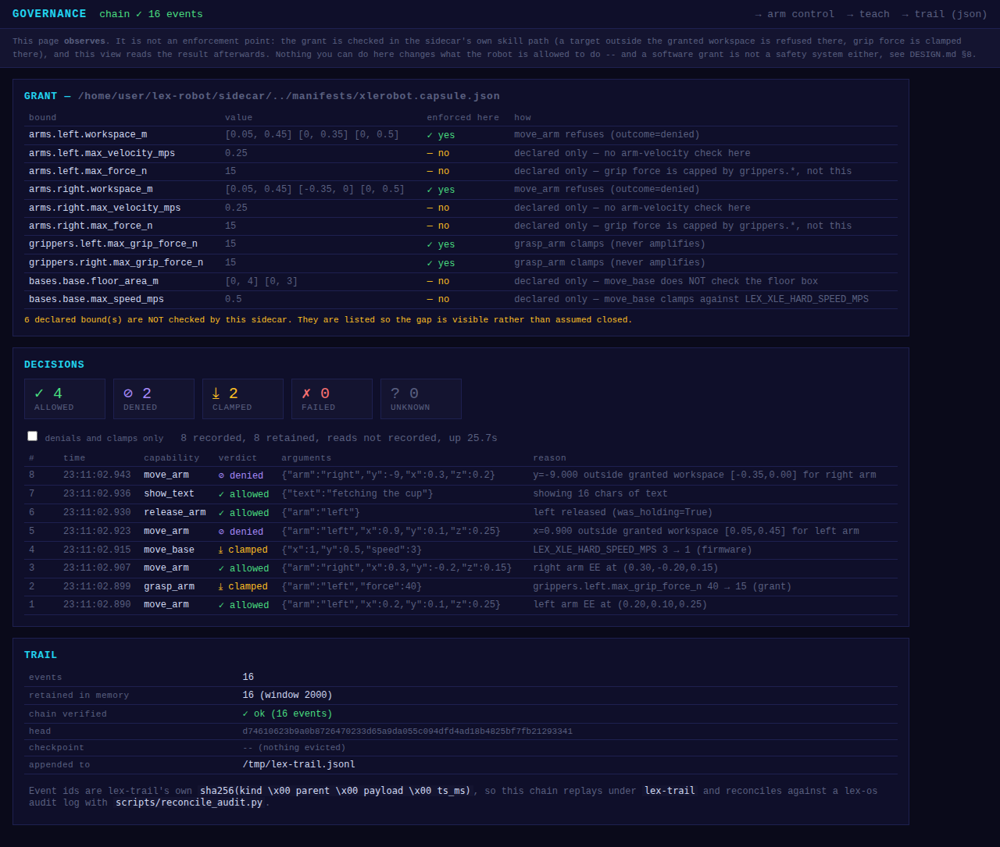

# leLab and lex-robot

[huggingface/leLab](https://github.com/huggingface/leLab) is LeRobot's web UI:
calibrate, teleoperate, record into a `LeRobotDataset`, launch training with live
logs, run inference, replay, upload to the Hub — a Vite frontend on `:8080` and a
FastAPI/uvicorn backend on `:8000`. It started at the 2025 LeRobot Worldwide
Hackathon and is maintained by the LeRobot team.

lex-robot sits **above** LeRobot and does not build a brain. So the question
"does leLab overlap us?" has a boring answer and an interesting one.

## The boring answer: almost no overlap

| leLab workflow | lex-robot today | verdict |
|---|---|---|
| calibrate | none — `capture_waypoints.py` defers to `lerobot-calibrate` | no overlap |
| teleoperate (leader→follower) | `GET /control` Cartesian jog, `scripted_teleop.py` | different modality |
| record → `LeRobotDataset` | `GET /teach` + `teach_to_dataset.py` | **real overlap** |
| train + live logs | none (`lerobot-train`, `xlerobot_rl_train.py`) | no overlap |
| inference / replay / Hub upload | `teach_replay` only | mostly no overlap |
| **what the grant did** | `GET /governance` (this change) | leLab has no equivalent |

The one duplicated strip is record-a-demonstration → dataset, and even there the
modality differs: leLab records leader–follower teleoperation, `teach` records
hand-guided motion with the torque off. Neither is a reimplementation of the
other, and the conversion into a real `LeRobotDataset` is done by *lerobot's own
API* in both cases (`sidecar/teach_to_dataset.py`).

Nothing here is a reason to build calibration, training or Hub upload UI. Use
leLab for those.

## The interesting answer: two authority paths is the actual problem

leLab's backend drives LeRobot's `Robot` classes directly. lex-robot's pages
drive `POST /skill/*`, which is where `_grant_workspace_violation` refuses an
out-of-box target, `_grant_max_grip_force` clamps grip force, the per-bus locks
serialise the serial traffic, and (now) the ledger records what happened.

Run both against the same arms and you have **two independent paths to the same
servos, one of which the grant does not cover**. That is the arrangement lex-os
exists to prevent — "do not add a second, independent source of authority" is the
one invariant in that repo's CLAUDE.md. So the useful thing to build was never a
rival record UI. It was these two:

---

## 1. `GET /governance` — the page leLab structurally can't have

Served by `xlerobot_sidecar.py` alongside `/control`, `/teach` and `/display`:
same inline-HTML, no-build-step, works-at-every-tier pattern.



It shows three things:

**The grant, and which of its bounds this sidecar actually checks.** A dashboard
that lists a declared bound as if it were enforced manufactures confidence the
code doesn't back, so each row says which function does the checking, or that
nothing here does. That column immediately earned itself: it surfaced that
`bases.*.floor_area_m` and `bases.*.max_speed_mps` were in
`manifests/xlerobot.capsule.json` while `move_base` checked neither — so a
direct caller could drive the base straight out of the granted room. Both are
enforced now (refuse the position, clamp the speed, exactly as the arms do).
It earned itself twice: the `workspace_m` row named `move_arm` as its only
enforcement point while `teach_replay` drove the same arm through joint-space
poses nothing checked against that box — now checked frame by frame through
forward kinematics, refused whole rather than stopped halfway (see
`docs/LEX_VS_PYTHON.md`, "Two kinds of bound"). `arms.*.max_velocity_mps`,
`arms.*.max_force_n` and the capsule's `skills` allowlist are still
declared-only here, and the page says so — the last with its reason, since it
is enforced in Lex against the agent and this port also answers the operator's
own pages.

**Every authority-exercising call, with the verdict the sidecar already reached**
— `allowed` / `denied` / `clamped` / `failed` / `unknown`. Read-only polling is
skipped by default (`/control` alone polls four times a second, which would bury
every real decision); `LEX_XLE_LEDGER_READS=1` includes it.

**A hash chain over the sequence.** Each decision emits `cap.invoked` /
`cap.completed` using lex-trail's own event-id formula
(`sha256(kind \x00 parent \x00 payload \x00 ts_ms)`), so `GET /governance/trail`
replays under `lex-trail` and reconciles against a lex-os audit log via
`scripts/reconcile_audit.py`. The in-memory window is bounded; evicted events
leave a checkpoint the retained window still verifies against, and
`LEX_XLE_TRAIL_PATH` keeps the full chain on disk.

**It observes; it never decides.** `sidecar/governance.py` has no enforcement
branch, and `classify()` never returns a verdict the sidecar didn't already
reach — when the reply doesn't say, the answer is `unknown`, not a guess.
Adding a second opinion here would be the exact mistake this layer is about.

## 2. `src/lelab_adapter.lex` — leLab's frontend over the skill API

```sh
python3 sidecar/xlerobot_sidecar.py &                        # the governed robot, :8900

lex run --allow-effects io,env,net,sense,actuate \
  src/lelab_adapter_full.lex run                             # full,      :8000
lex run --allow-effects io,env,net,sense \
  src/lelab_adapter.lex run_readonly                         # read-only, :8000

curl -s localhost:8000/lex/routes | python3 -m json.tool     # what is and isn't served
```

Speaks leLab's HTTP routes on leLab's own port and executes nothing itself:
every request that touches the robot goes through `skills.lex` / `sense.lex`,
so it inherits the grant gate, then the sidecar's own checks, then the ledger.

```console
$ curl -s -X POST localhost:8000/move-arm -d '{"arm":"right","x":0.9,"y":-0.2,"z":0.15}'
{"success":false,"governed":true,"outcome":"denied",
 "detail":"right arm target outside granted workspace (granted: x 0.05..0.45, y -0.35..0.35, z 0..0.5)"}
```

Note where that refusal came from: `grant.lex`, not the sidecar. The request
was **never sent** — two `/move-arm` calls in, one `POST /skill/move_arm` out.
The Python version this replaced could only let the request travel to the
sidecar and be refused there.

### The read-only entry point is a type, not a flag

This is the part a Python adapter cannot have:

| module | effect row | can it move the arm? |
|---|---|---|
| `src/lelab_adapter.lex` | `[env, io, net, sense]` | **no — not in the row** |
| `src/lelab_adapter_full.lex` | `[env, io, net, sense, actuate]` | yes, grant-gated |

```console
$ lex run --allow-effects io,env,net,sense src/lelab_adapter.lex run_readonly
lex-robot leLab adapter [READ-ONLY] on http://127.0.0.1:8000
  no actuate effect in this entry point -- the arm cannot be moved from here

$ lex run --allow-effects io,env,net,sense src/lelab_adapter_full.lex run
{"kind":"effect_not_allowed","detail":"effect `actuate` not in --allow-effects", ... }
```

**The module boundary is the authority boundary.** `--allow-effects` is checked
over the whole reachable import graph, not just the functions the entry point
calls — a single file importing `skills` is refused under a sense-only policy
even if its read-only entry point never actuates. So a read-only program may
not merely *avoid* calling an actuating function; it must not be able to reach
one. That is why the adapter is two modules, and why `sense.lex` was split from
`skills.lex` in the first place. `scripts/smoke.sh` asserts all three halves:
the sensing module's row has no `actuate`, the full module refuses to serve
without it, and a read-only handler that reaches for `move_arm` fails
`lex check`.

### What it serves

| leLab route | becomes |
|---|---|
| `GET /health` | `sense.read_joints` reachability |
| `GET /joint-positions` | `sense.read_joints_arm` on both arms, translated to leLab's URDF names |
| `GET /available-cameras` | `sense.read_camera` probe — live frames only |
| `GET /recording-status`, `GET /datasets` | `sense.teach_status` / `sense.teach_list` |
| `GET /teleoperation-status` | adapter state (no robot call) |
| `GET /lex/routes` | this table, and which mode it is in |
| `POST /move-arm` | `skills.move_arm` — absolute Cartesian target, grant-gated |
| `POST /start-recording` | `skills.teach_start` |
| `POST /stop-recording`, `POST /recording-exit-early` | `skills.teach_stop` |

The adapter's own grant is deliberately narrow — and the fact that it *can* be
narrow is new: `teach_replay`, `teach_home_go`, `release_arm` and `reset` had
no Lex wrapper at all until this change, so no grant could name them either
way. One omission is still worth naming: **`teach_free` is not granted.** Freeing an arm drops servo torque and
it falls unless a hand is already on it, and leLab's UI has no button that
means "I am holding the arm right now". Recording is granted; making the arm
limp from a browser is not.

### What it refuses, and why that's the point

leLab's surface is much wider than the governed skill surface. The honest
answer to a route the skill API cannot express is a `501` naming the reason —
not a plausible-looking implementation that quietly reaches around the grant.

**Not expressible through the skill API** (implementing it would mean a second
path to the servos): `/move-arm` in its leader–follower form (a continuous
mirroring loop with no target in it, and no leader on this side to read);
`/start-calibration` and friends (no calibration skill, and calibration drives
the servos through their full range); `/start-inference` (no policy-execution
skill on this sidecar); `/available-ports` (serial-bus enumeration, below the
skill API); `/ws/joint-data` (the sidecar's own `/stream` is the governed
equivalent); `/recording-rerecord-episode` (teach has no episode index);
`/camera-feed/{cam}` MJPEG restreaming (not yet built on `BodyStream`).

**Not lex-robot's layer** (never touches the arm, so there is nothing to
govern — run leLab against LeRobot directly): `/jobs/*` (training),
`/upload-dataset`, `/hf-auth/*`, `/system/*`, `/get-configs`, `/robots*`,
dataset management.

Two smaller refusals in the same spirit: a `RecordingRequest` with
`num_episodes > 1` is refused rather than silently recording one and reporting
success, and a `/move-arm` body missing an axis is refused rather than
defaulting `z` to 0 and driving the arm at the floor.

### Status

Verified end to end against the Tier-1 stub sidecar: both entry points, the
grant refusal round trip (and its absence from the sidecar log), the recording
flow, and the ledger entries. It has **not** been driven by leLab's actual
frontend build — that is the next step, and `GET /lex/routes` exists so it is a
five-second question rather than a debugging session.

The pure mapping layer carries `examples {}` blocks instead of a test file:
they are folded into each function's SigId and run at `lex check` time, so they
cannot drift from the code they document.

## Where this leaves the two projects

leLab is the front door to LeRobot's lifecycle. lex-robot is the envelope around
whatever policy comes out of it. The overlap is one strip of recording UI, and
the complement — "leLab's UX, but the arm physically cannot leave the granted
workspace, and every command is in a hash chain" — is a better demo than either
alone. That is also exactly the Switzerland-layer position in `POSITIONING.md`:
run above LeRobot, don't compete with it.
